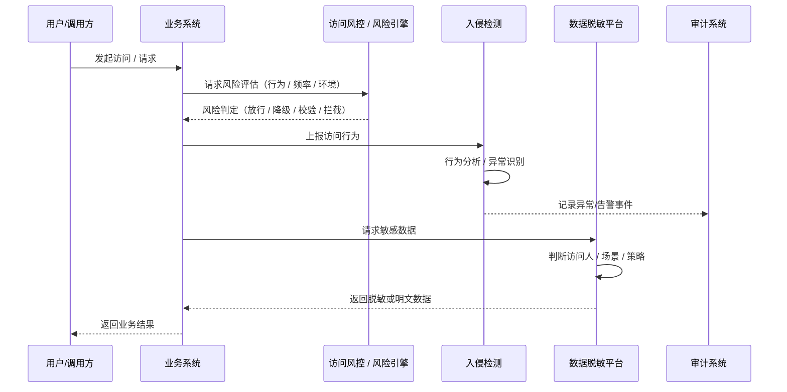
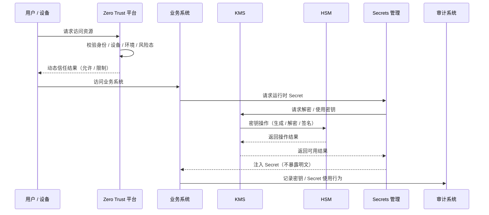
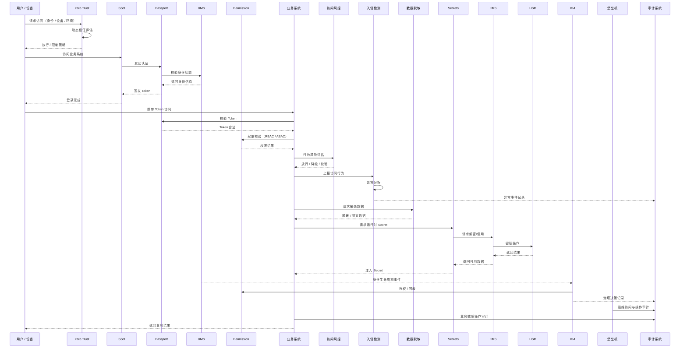

# overview

 ```
P2（数据 & 风险）
├── 数据脱敏平台
├── 安全平台（风控 / 入侵检测）
├── 访问风控 / 风险引擎

P3（零信任 & 密钥）
├── Zero Trust 平台
├── HSM / KMS
├── Secrets 管理
```

## P2｜数据 & 风险（Data & Risk）

> **请求进来之后，它“看起来正不正常”、数据“该不该看这么多”**




## P3｜零信任 & 密钥（Zero Trust & Secrets）

> **访问之前，先确认你是谁、设备靠不靠谱、有没有资格拿到关键材料**



核心逻辑:

Zero Trust 决定这次访问，值不值得信

Secrets / KMS / HSM 决定关键材料，能不能给你用

# 企业级安全全景调用时序图（P0 + P1 + P2 + P3）



# 相关开源项目

可以参考一下老马开源的项目：

敏感词核心库: https://github.com/houbb/sensitive-word

敏感词控台：https://github.com/houbb/sensitive-word-admin

日志脱敏：https://github.com/houbb/sensitive

加密工具：https://github.com/houbb/encryption-local

* any list
{:toc}