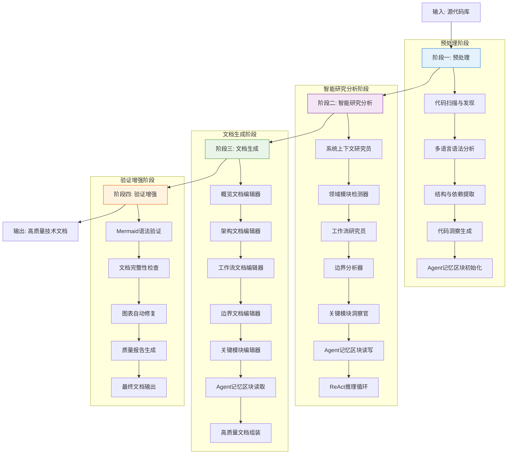
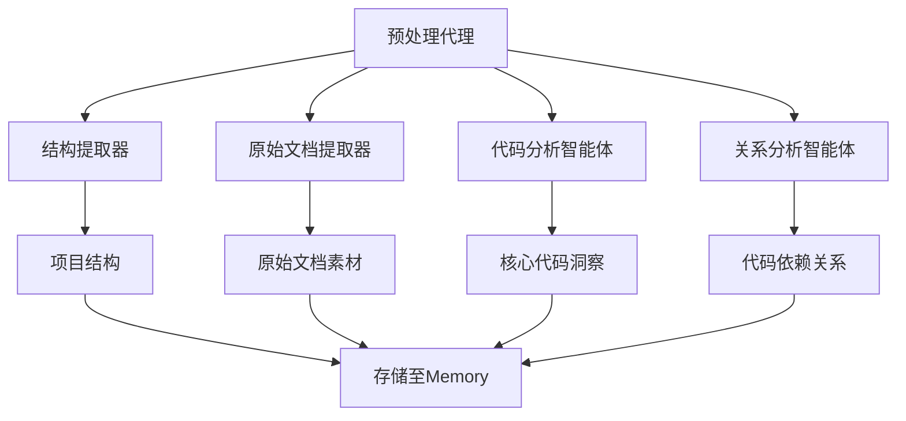
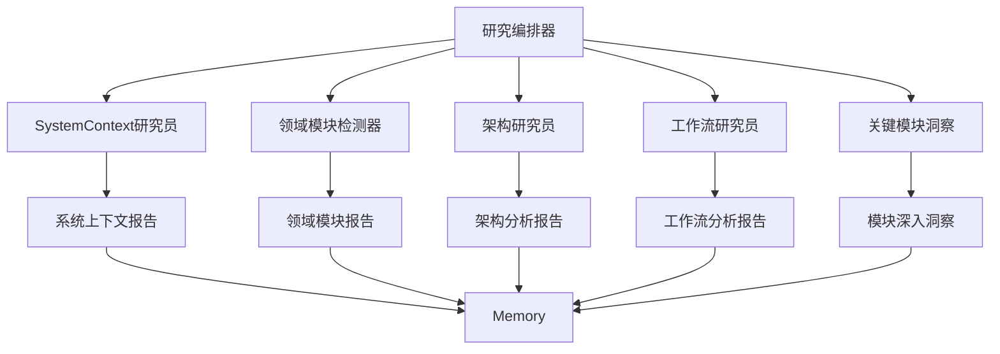
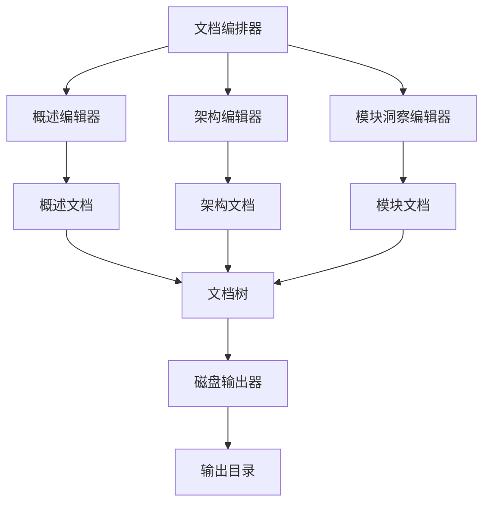
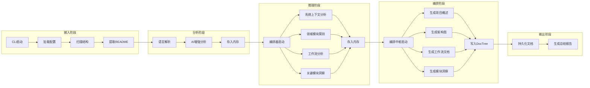
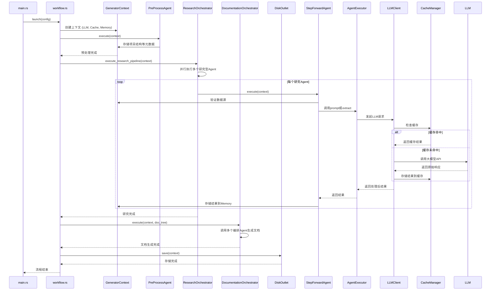

<p align="center">
  
</p>

<h3 align="center">Litho (deepwiki-rs)</h3>

<p align="center">
    <a href="./README.md">English</a>
    |
    <a href="./README_zh.md">中文</a>
</p>
<p align="center">💪🏻 基于 <strong>Rust</strong> 的高性能 <strong>AI 驱动</strong> 文档生成引擎（类 DeepWiki）</p>
<p align="center">📚 自动为任意代码库生成高质量的 <strong>Repo-Wiki / 项目架构文档</strong></p>

<p align="center">
  <a href="https://crates.io/crates/deepwiki-rs"></a>
  <a href="https://crates.io/crates/deepwiki-rs"></a>
  
</p>

<hr />

# 👋 什么是 Litho

**Litho**（也称为deepwiki-rs）是一个基于Rust的高性能AI文档生成引擎，能够自动为软件项目创建全面的技术说明文档。通过先进的AI分析能力，Litho智能地探索项目结构，识别核心模块，分析依赖关系，并生成专业的架构文档。

**Litho**采用基于静态代码分析 与 AI Multi-Agents的多引擎工作流，将静态代码分析与大型语言模型（LLM）智能相结合。能把原始代码转换为清晰组织的文档，自动生成上下文图（Context）、容器图（Container）、组件图（Component）以及代码级别的文档内容，适用于开发者、架构师或技术负责人，帮助团队始终保持准确、最新的架构信息。

❤️ 喜欢 **Litho**? 点亮小星星 🌟 或 [赞助](https://github.com/sponsors/sopaco)! ❤️

# 😺 为什么使用 Litho

- 自动使文档与代码变更保持同步，告别过时文档
- 节省大量手工编写和维护文档的时间
- 改善新成员的入职体验，提供完整、及时的项目知识
- 在代码审查时提供清晰的架构背景，提升讨论效率
- 满足合规与审计需求，生成可追溯的自动化文档
- 支持多种编程语言：Rust、Python、Java、Go、C#、JavaScript 等
- 自动生成专业的 C4 模型图表（Context / Container / Component / Code）
- 可集成到 CI/CD 流程，随每次提交自动生成文档

# 🌠 功能与能力

### 核心能力
- 基于代码库分析的 AI 驱动架构文档生成
- 自动创建 C4 模型图（Context、Container、Component、Code）
- 智能抽取代码注释、结构与依赖关系
- 多语言支持与可扩展的语言处理器
- 自定义模板系统支持文档输出样式定制

### 高级特性
- Git 历史分析以追踪架构演进
- 代码元素与文档之间的交叉引用
- 带图示与示例的交互式文档
- 与 CI/CD 集成，实现自动化文档生成

## 💡 解决的问题
Litho 自动从源代码生成最新的架构文档，解决了传统手工文档经常滞后、缺失或不完整的问题，让文档始终保持与代码一致。

# 🌐 Litho Eco 生态

Litho 属于一套完整的生态工具，用于提升文档质量与开发效率，下列工具可以和 Litho 无缝配合：

## 📘 Litho Book
**Litho Book** 是一个高性能的 Markdown 阅读器（基于 Rust + Axum），用于展示 Litho 生成的文档，提供优雅的浏览体验。

### 主要功能
- 实时 Markdown 渲染与语法高亮
- 完整的 Mermaid 图表支持（架构图）
- 文件与内容的模糊搜索
- 低内存占用的高性能架构
- 基于 AI 的文档理解与问答

### 🌠 运行截图
<div style="text-align: center;">
  <table style="width: 100%; margin: 0 auto;">
    <tr>
      <td style="width: 50%;"></td>
      <td style="width: 50%;"></td>
    </tr>
  </table>
</div>

[了解更多 Litho Book](https://github.com/sopaco/litho-book)

## 🔧 Mermaid Fixer
**Mermaid Fixer** 是一个高性能的 AI 工具，用于自动检测并修复 Markdown 文件中 Mermaid 图表的语法错误，确保图表能够正确渲染。

### 主要功能
- 自动扫描目录并定位 Markdown 文件中的 Mermaid 图
- 使用 JS 沙箱或解析器检测语法错误
- 使用 LLM 智能修复并生成修复报告
- 支持多个 LLM 提供商与可配置策略

### 👀 运行截图
<div style="text-align: center;">
  <table style="width: 100%; margin: 0 auto;">
    <tr>
      <td style="width: 50%;"></td>
      <td style="width: 50%;"></td>
    </tr>
  </table>
</div>

[了解更多 Mermaid Fixer](https://github.com/sopaco/mermaid-fixer)

# 🧠 工作原理

Litho 的处理流程基于一个四阶段流水线，将原始代码逐步转化为高质量文档：预处理（Preprocessing）→ 研究（Research）→ 编排（Composition）→ 输出（Output/Validation）。



## 四阶段处理流水线（概览）
1. 预处理阶段：扫描代码库、抽取文件与元数据、识别模块与依赖。
2. 研究阶段：引入多个 AI 智能体分析系统上下文、架构模式、工作流与模块职责。
3. 编排阶段：将研究结果整合为结构化文档（概述、架构、模块深挖）。
4. 输出与验证阶段：格式化输出，校验图表语法，生成覆盖率报告并持久化。

### 预处理阶段
### 预处理阶段

该阶段负责从项目中提取基础元数据，为后续 AI 分析提供输入。



### 研究阶段

此阶段通过多个并行运行的智能体，对项目进行多层次深度调研。



### 编排与输出阶段

最后阶段将研究结果整合成最终文档，并持久化到磁盘。



# 🏗️ 架构概览

**Litho**具有复杂的模块化架构，专为高性能、可扩展性和智能分析而设计。系统实现了多阶段工作流，配备专门的AI智能体和全面的缓存机制。



## 核心模块

- **生成器工作流**：协调整个四阶段文档生成流水线
- **语言处理器系统**：支持10+种编程语言，为Rust、Python、JavaScript/TypeScript、Java、Kotlin、React、Vue、Svelte等提供专用处理器
- **多智能体研究系统**：使用ReAct模式进行深度项目分析的专门AI智能体
- **智能文档编排器**：AI驱动的编辑器，将研究结果综合为专业的技术说明文档
- **ReAct执行器LLM客户端**：先进的LLM集成，支持带工具使用的推理和行动循环
- **高速缓存与上下文记忆系统**：具有智能缓存和内存管理的性能优化
- **文件系统工具**：用于项目分析的全面文件探索和读取能力

## 核心流程
Litho 的执行流程遵循一个清晰的管道模式：`预处理` → `深度研究` → `文档编排` → `输出存储`。整个流程由 `launch` 函数驱动，通过 `GeneratorContext` 注入所有依赖。



# 🖥️ 快速开始

### 前提条件
- [Rust](https://www.rust-lang.org)（建议版本 1.70 或更高）
- [Cargo](https://doc.rust-lang.org/cargo/)
- 网络访问（用于调用 LLM 提供商的 API）

### 安装

#### 方式一：从 crates.io 安装（推荐）
```sh
cargo install deepwiki-rs
```

#### 方式二：从源码构建
```sh
git clone https://github.com/sopaco/deepwiki-rs.git
cd deepwiki-rs
cargo build --release
# 可执行文件位于 target/release 目录
```

# 🚀 使用方法

Litho 提供简单的命令行界面来生成文档。For more configuration parameters, refer to the [CLI全参数说明](https://github.com/sopaco/deepwiki-rs/blob/main/docs/5%E3%80%81%E8%BE%B9%E7%95%8C%E8%B0%83%E7%94%A8.md#litho)。

### 基本命令示例
```sh
# 为当前项目生成文档（默认设置）
deepwiki-rs

# 指定项目目录与输出目录
deepwiki-rs -p ./my-project -o ./docs

# 生成使用特定语种描述的文档（例如日文）
deepwiki-rs --target-language ja -p ./my-project

```

### 文档生成示例（带 LLM 配置）
```sh
deepwiki-rs -p ./src --llm-api-base-url <your-llm-base-url> --llm-api-key <your-api-key> --model-efficient GPT-5-mini
```

### 其他常见选项
```sh
# 跳过阶段（示例）
deepwiki-rs --skip-preprocessing --skip-research

# 关闭 ReAct 模式（避免使用工具自动扫描）
deepwiki-rs -p ./src --disable-preset-tools --llm-api-base-url <base> --llm_api_key <key>

# 高级并行/上下文配置
deepwiki-rs --config <config-file> --max-tokens 4000 --temperature 0.7 --max-parallels 4 --no-cache --force-regenerate
```

## 📁 默认输出结构（示例）
```sh
project-docs/
|_ 1、项目概述          # 项目概述、核心功能、技术栈
|_ 2、架构概览          # 整体架构、核心流程、模块分解
|_ 3、工作流程          # 整体架构、核心流程、模块分解
|_ 4、深入研究/         # 详细的技术主题实现文档
    |_ 主题1.md
    |_ 主题2.md
```

# 🤝 贡献

欢迎各种形式的贡献！通过 [GitHub Issues](https://github.com/sopaco/deepwiki-rs/issues) 报告问题或提交功能请求。

## 贡献方式
- 添加对新语言的支持（实现 LanguageProcessor 抽象）
- 设计新的文档模板与样式
- 改善 Mermaid 图表生成策略与可视化效果
- 提升性能与缓存策略
- 添加更多测试覆盖不同代码模式
- 增强 LLM 智能体与工具集成
- 提供国际化与本地化支持

## 开发贡献流程
1. Fork 本仓库
2. 创建功能分支：`git checkout -b feature/amazing-feature`
3. 提交变更：`git commit -m 'Add some amazing feature'`
4. 推送分支并发起 Pull Request

# 🪪 许可证
本项目使用 **MIT** 许可证，详见仓库中的 [LICENSE](./LICENSE) 文件。

# 👨 关于作者

> 🚀 如果你喜欢这个项目，请考虑在 GitHub 支持我： [sponsaco on GitHub](https://github.com/sopaco)

作者为一名资深互联网从业者，经历 PC 互联网、移动互联网与 AI 应用多个发展阶段，具有丰富的产品和研发经验。目前在快手从事大前端与 AI 探索相关工作。

* any list
{:toc}