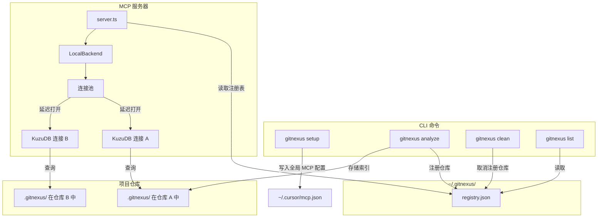
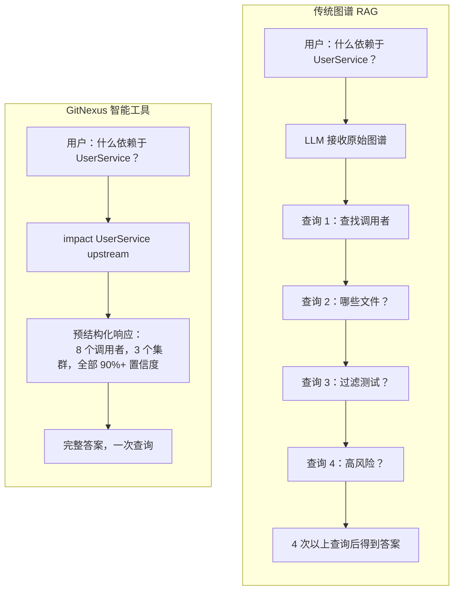

# GitNexus

⚠️ 重要提示：**GitNexus 没有任何官方的加密货币、代币或币。任何在 Pump.fun 或其他平台上使用 GitNexus 名称的代币/币**均与本项目或其维护者无关、未经认可、也非其创建。**请勿购买任何声称与 GitNexus 有关的加密货币。**

<div align="center">

  <a href="https://trendshift.io/repositories/19809" target="_blank">
    
  </a>

  <h2>加入官方 Discord 讨论想法、问题等！</h2>

  <a href="https://discord.gg/AAsRVT6fGb">
    
  </a>
  <a href="https://www.npmjs.com/package/gitnexus">
    
  </a>
  <a href="https://polyformproject.org/licenses/noncommercial/1.0.0/">
    
  </a>

</div>

**为智能体上下文构建神经系统。**

将任何代码库索引为知识图谱——每个依赖、调用链、集群和执行流——然后通过智能工具暴露出来，使 AI 智能体永远不会遗漏代码。

https://github.com/user-attachments/assets/172685ba-8e54-4ea7-9ad1-e31a3398da72

> *就像 DeepWiki，但更深入。* DeepWiki 帮助你*理解*代码。GitNexus 让你能够*分析*代码——因为知识图谱追踪的是每一个关系，而不仅仅是描述。

**太长不看：** **Web UI** 是一种与任何代码库聊天的快捷方式。**CLI + MCP** 则是让你的 AI 智能体真正可靠的方式——它为 Cursor、Claude Code 等工具提供了代码库的深度架构视图，使它们不再遗漏依赖、破坏调用链或盲目编辑。即使是较小的模型也能获得完整的架构清晰度，使其能与巨头模型竞争。

---

## Star 历史

[](https://www.star-history.com/#abhigyanpatwari/GitNexus&type=date&legend=top-left)


## 使用 GitNexus 的两种方式

|                   | **CLI + MCP**                                            | **Web UI**                                             |
| ----------------- | -------------------------------------------------------------- | ------------------------------------------------------------ |
| **是什么**    | 在本地索引代码库，通过 MCP 连接 AI 智能体                 | 浏览器中的可视化图谱探索 + AI 聊天                   |
| **适用场景**     | 日常开发，配合 Cursor、Claude Code、Windsurf、OpenCode 使用 | 快速探索、演示、一次性分析                   |
| **规模**   | 完整的代码库，任意大小                                           | 受浏览器内存限制（约 5000 个文件），或通过后端模式无限制 |
| **安装** | `npm install -g gitnexus`                                    | 无需安装——访问 [gitnexus.vercel.app](https://gitnexus.vercel.app) |
| **存储** | KuzuDB 原生（快速，持久）                               | KuzuDB WASM（内存中，每个会话独立）                         |
| **解析** | Tree-sitter 原生绑定                                    | Tree-sitter WASM                                             |
| **隐私** | 一切在本地，无网络请求                                   | 一切在浏览器内，无服务器                             |

> **桥接模式：** `gitnexus serve` 连接两者——Web UI 会自动检测本地服务器，无需重新上传或重新索引即可浏览所有通过 CLI 索引的代码库。

---

## CLI + MCP（推荐）

CLI 会索引你的仓库并运行一个 MCP 服务器，为 AI 智能体提供深度的代码库感知能力。

### 快速开始

```bash
# 在你的仓库根目录运行
npx gitnexus analyze
```

就这么简单。该命令会索引代码库、安装智能体技能、注册 Claude Code 钩子，并创建 `AGENTS.md` / `CLAUDE.md` 上下文文件——全部通过一个命令完成。

要为你的编辑器配置 MCP，只需运行一次 `npx gitnexus setup`——或按照下面的步骤手动设置。

### MCP 设置

`gitnexus setup` 会自动检测你的编辑器并写入正确的全局 MCP 配置。你只需要运行一次。

### 编辑器支持

| 编辑器                | MCP | 技能 | 钩子（自动增强） | 支持程度        |
| --------------------- | --- | ------ | -------------------- | -------------- |
| **Claude Code** | 是 | 是    | 是（PreToolUse）     | **完整** |
| **Cursor**      | 是 | 是    | —                   | MCP + 技能   |
| **Windsurf**    | 是 | —     | —                   | MCP            |
| **OpenCode**    | 是 | 是    | —                   | MCP + 技能   |

> **Claude Code** 获得最深入的集成：MCP 工具 + 智能体技能 + PreToolUse 钩子，可自动使用知识图谱上下文增强 grep/glob/bash 调用。

### 社区集成

| 智能体 | 安装命令 | 来源 |
|-------|---------|--------|
| [pi](https://pi.dev) | `pi install npm:pi-gitnexus` | [pi-gitnexus](https://github.com/tintinweb/pi-gitnexus) |

如果你更喜欢手动配置：

**Claude Code**（完整支持——MCP + 技能 + 钩子）：

```bash
claude mcp add gitnexus -- npx -y gitnexus@latest mcp
```

**Cursor**（`~/.cursor/mcp.json`——全局配置，适用于所有项目）：

```json
{
  "mcpServers": {
    "gitnexus": {
      "command": "npx",
      "args": ["-y", "gitnexus@latest", "mcp"]
    }
  }
}
```

**OpenCode**（`~/.config/opencode/config.json`）：

```json
{
  "mcp": {
    "gitnexus": {
      "command": "npx",
      "args": ["-y", "gitnexus@latest", "mcp"]
    }
  }
}
```

### CLI 命令

```bash
gitnexus setup                    # 为你的编辑器配置 MCP（一次性）
gitnexus analyze [path]           # 索引一个仓库（或更新过时的索引）
gitnexus analyze --force          # 强制完全重新索引
gitnexus analyze --skip-embeddings  # 跳过嵌入生成（更快）
gitnexus mcp                     # 启动 MCP 服务器（stdio）——服务于所有已索引的仓库
gitnexus serve                   # 启动本地 HTTP 服务器（多仓库），供 Web UI 连接
gitnexus list                    # 列出所有已索引的仓库
gitnexus status                  # 显示当前仓库的索引状态
gitnexus clean                   # 删除当前仓库的索引
gitnexus clean --all --force     # 删除所有索引
gitnexus wiki [path]             # 从知识图谱生成仓库维基
gitnexus wiki --model <model>    # 使用自定义 LLM 模型生成维基（默认：gpt-4o-mini）
gitnexus wiki --base-url <url>   # 使用自定义 LLM API 基础 URL 生成维基
```

### 你的 AI 智能体获得什么

**通过 MCP 暴露的 7 个工具**：

| 工具               | 功能                                                      | `repo` 参数 |
| ------------------ | ----------------------------------------------------------------- | -------------- |
| `list_repos`     | 发现所有已索引的仓库                                 | —             |
| `query`          | 按流程分组的混合搜索（BM25 + 语义 + RRF）             | 可选       |
| `context`        | 360 度符号视图——分类的引用、流程参与度 | 可选       |
| `impact`         | 影响范围分析，按深度分组并带置信度          | 可选       |
| `detect_changes` | Git diff 影响分析——将更改的行映射到受影响的流程       | 可选       |
| `rename`         | 多文件协调重命名，结合图谱和文本搜索            | 可选       |
| `cypher`         | 原始 Cypher 图谱查询                                          | 可选       |

> 当只索引了一个仓库时，`repo` 参数是可选的。如果有多个仓库，请指定使用哪一个：`query({query: "auth", repo: "my-app"})`。

**用于即时上下文的资源**：

| 资源                                  | 目的                                              |
| ----------------------------------------- | ---------------------------------------------------- |
| `gitnexus://repos`                      | 列出所有已索引的仓库（先读这个）      |
| `gitnexus://repo/{name}/context`        | 代码库统计、过时检查和可用工具 |
| `gitnexus://repo/{name}/clusters`       | 所有功能集群及其内聚性得分         |
| `gitnexus://repo/{name}/cluster/{name}` | 集群成员和详细信息                          |
| `gitnexus://repo/{name}/processes`      | 所有执行流                                  |
| `gitnexus://repo/{name}/process/{name}` | 完整的流程跟踪，包含步骤                        |
| `gitnexus://repo/{name}/schema`         | 用于 Cypher 查询的图谱模式         |

**2 个 MCP 提示词**，用于引导工作流：

| 提示词            | 功能                                                              |
| ----------------- | ------------------------------------------------------------------------- |
| `detect_impact` | 提交前变更分析——影响范围、受影响的流程、风险等级       |
| `generate_map`  | 从知识图谱生成包含 mermaid 图表的架构文档 |

**4 个智能体技能**，自动安装到 `.claude/skills/`：

- **探索**——使用知识图谱导航不熟悉的代码
- **调试**——通过调用链追踪 Bug
- **影响分析**——在变更前分析影响范围
- **重构**——使用依赖映射规划安全的重构

---

## 多仓库 MCP 架构

GitNexus 使用**全局注册表**，因此一个 MCP 服务器可以服务于多个已索引的仓库。无需为每个项目配置 MCP——只需设置一次，即可在所有地方工作。



**工作原理：** 每次执行 `gitnexus analyze` 都会将索引存储在仓库内的 `.gitnexus/` 目录中（可移植，已加入 gitignore），并在 `~/.gitnexus/registry.json` 中注册一个指针。当 AI 智能体启动时，MCP 服务器读取注册表，并可以为任何已索引的仓库提供服务。KuzuDB 连接在首次查询时延迟打开，并在不活动 5 分钟后被驱逐（最多 5 个并发连接）。如果只索引了一个仓库，则所有工具的 `repo` 参数都是可选的——智能体无需更改任何东西。

---

## Web UI（基于浏览器）

一个完全客户端的图谱探索器和 AI 聊天工具。无需服务器，无需安装——你的代码永远不会离开浏览器。

**立即尝试：** [gitnexus.vercel.app](https://gitnexus.vercel.app)——拖放一个 ZIP 文件即可开始探索。


或者在本地运行：

```bash
git clone https://github.com/abhigyanpatwari/gitnexus.git
cd gitnexus/gitnexus-web
npm install
npm run dev
```

Web UI 使用与 CLI 相同的索引管道，但完全在 WebAssembly 中运行（Tree-sitter WASM、KuzuDB WASM、浏览器内嵌入）。它非常适合快速探索，但对于较大的代码库受限于浏览器内存。

**本地后端模式：** 运行 `gitnexus serve` 并在本地打开 Web UI——它会自动检测服务器并显示所有已索引的仓库，支持完整的 AI 聊天。无需重新上传或重新索引。智能体的工具（Cypher 查询、搜索、代码导航）会自动通过后端 HTTP API 路由。

---

## GitNexus 解决的问题

像 **Cursor**、**Claude Code**、**Cline**、**Roo Code** 和 **Windsurf** 这样的工具功能强大——但它们并不真正了解你的代码库结构。

**会发生什么：**

1. AI 编辑 `UserService.validate()`
2. AI 不知道有 47 个函数依赖于它的返回类型
3. **破坏性变更上线**

### 传统图谱 RAG 与 GitNexus 对比

传统方法将原始图谱边提供给 LLM，并希望它探索得足够多。GitNexus 在**索引时预先计算结构**——聚类、追踪、评分——因此工具可以在一次调用中返回完整的上下文：



**核心创新：预计算的关系智能**

- **可靠性**——LLM 不会遗漏上下文，因为它已经在工具响应中
- **Token 效率**——无需 10 次查询链来理解一个函数
- **模型民主化**——较小的 LLM 也能工作，因为工具完成了繁重的工作

---

## 工作原理

GitNexus 通过多阶段索引管道构建代码库的完整知识图谱：

1. **结构**——遍历文件树，映射文件夹/文件关系
2. **解析**——使用 Tree-sitter AST 提取函数、类、方法和接口
3. **解析**——使用语言感知逻辑跨文件解析导入和函数调用
4. **聚类**——将相关符号分组为功能社区
5. **流程**——从入口点通过调用链追踪执行流
6. **搜索**——构建混合搜索索引以实现快速检索

### 支持的语言

TypeScript、JavaScript、Python、Java、Kotlin、C、C++、C#、Go、Rust、PHP、Swift

---

## 工具示例

### 影响分析

```
impact({target: "UserService", direction: "upstream", minConfidence: 0.8})

目标：类 UserService (src/services/user.ts)

上游（什么依赖于此）：
  深度 1（将会破坏）：
    handleLogin [调用 90%] -> src/api/auth.ts:45
    handleRegister [调用 90%] -> src/api/auth.ts:78
    UserController [调用 85%] -> src/controllers/user.ts:12
  深度 2（可能受影响）：
    authRouter [导入] -> src/routes/auth.ts
```

选项：`maxDepth`、`minConfidence`、`relationTypes`（`CALLS`、`IMPORTS`、`EXTENDS`、`IMPLEMENTS`）、`includeTests`

### 按流程分组搜索

```
query({query: "authentication middleware"})

processes:
  - summary: "LoginFlow"
    priority: 0.042
    symbol_count: 4
    process_type: cross_community
    step_count: 7

process_symbols:
  - name: validateUser
    type: Function
    filePath: src/auth/validate.ts
    process_id: proc_login
    step_index: 2

definitions:
  - name: AuthConfig
    type: Interface
    filePath: src/types/auth.ts
```

### 上下文（360 度符号视图）

```
context({name: "validateUser"})

symbol:
  uid: "Function:validateUser"
  kind: Function
  filePath: src/auth/validate.ts
  startLine: 15

incoming:
  calls: [handleLogin, handleRegister, UserController]
  imports: [authRouter]

outgoing:
  calls: [checkPassword, createSession]

processes:
  - name: LoginFlow (步骤 2/7)
  - name: RegistrationFlow (步骤 3/5)
```

### 检测变更（提交前）

```
detect_changes({scope: "all"})

summary:
  changed_count: 12
  affected_count: 3
  changed_files: 4
  risk_level: medium

changed_symbols: [validateUser, AuthService, ...]
affected_processes: [LoginFlow, RegistrationFlow, ...]
```

### 重命名（多文件）

```
rename({symbol_name: "validateUser", new_name: "verifyUser", dry_run: true})

status: success
files_affected: 5
total_edits: 8
graph_edits: 6     （高置信度）
text_search_edits: 2  （需仔细审查）
changes: [...]
```

### Cypher 查询

```cypher
-- 查找以高置信度调用 auth 函数的内容
MATCH (c:Community {heuristicLabel: 'Authentication'})<-[:CodeRelation {type: 'MEMBER_OF'}]-(fn)
MATCH (caller)-[r:CodeRelation {type: 'CALLS'}]->(fn)
WHERE r.confidence > 0.8
RETURN caller.name, fn.name, r.confidence
ORDER BY r.confidence DESC
```

---

## 维基生成

从你的知识图谱生成由 LLM 驱动的文档：

```bash
# 需要 LLM API 密钥（OPENAI_API_KEY 等）
gitnexus wiki

# 使用自定义模型或提供商
gitnexus wiki --model gpt-4o
gitnexus wiki --base-url https://api.anthropic.com/v1

# 强制完全重新生成
gitnexus wiki --force
```

维基生成器读取已索引的图谱结构，通过 LLM 将文件分组到模块中，为每个模块生成文档页面，并创建一个概览页面——所有页面都带有指向知识图谱的交叉引用。

---

## 技术栈

| 层                     | CLI                                   | Web                                     |
| ------------------------- | ------------------------------------- | --------------------------------------- |
| **运行时**         | Node.js（原生）                      | 浏览器（WASM）                          |
| **解析**         | Tree-sitter 原生绑定           | Tree-sitter WASM                        |
| **数据库**        | KuzuDB 原生                         | KuzuDB WASM                             |
| **嵌入**      | HuggingFace transformers.js（GPU/CPU） | transformers.js（WebGPU/WASM）           |
| **搜索**          | BM25 + 语义 + RRF                 | BM25 + 语义 + RRF                   |
| **智能体接口** | MCP（stdio）                           | LangChain ReAct 智能体                   |
| **可视化**   | —                                    | Sigma.js + Graphology（WebGL）           |
| **前端**        | —                                    | React 18、TypeScript、Vite、Tailwind v4 |
| **聚类**      | Graphology                            | Graphology                              |
| **并发**     | 工作线程 + async                | Web Workers + Comlink                   |

---

## 路线图

### 正在积极构建

- [ ] **LLM 集群增强**——通过 LLM API 生成语义集群名称
- [ ] **AST 装饰器检测**——解析 @Controller、@Get 等
- [ ] **增量索引**——仅重新索引更改过的文件

### 最近完成

- [X] 维基生成、多文件重命名、Git diff 影响分析
- [X] 按流程分组搜索、360 度上下文、Claude Code 钩子
- [X] 多仓库 MCP、零配置设置、支持 11 种语言
- [X] 社区检测、流程检测、置信度评分
- [X] 混合搜索、向量索引

---

## 安全与隐私

- **CLI**：一切在本地机器上运行。无网络调用。索引存储在 `.gitnexus/` 中（已加入 gitignore）。全局注册表位于 `~/.gitnexus/`，仅存储路径和元数据。
- **Web**：一切在浏览器中运行。没有代码上传到任何服务器。API 密钥仅存储在 localStorage 中。
- 开源——你可以自行审计代码。

---

## 致谢

- [Tree-sitter](https://tree-sitter.github.io/)——AST 解析
- [KuzuDB](https://kuzudb.com/)——支持向量的嵌入式图谱数据库
- [Sigma.js](https://www.sigmajs.org/)——WebGL 图谱渲染
- [transformers.js](https://huggingface.co/docs/transformers.js)——浏览器机器学习
- [Graphology](https://graphology.github.io/)——图谱数据结构
- [MCP](https://modelcontextprotocol.io/)——模型上下文协议

# 参考资料

https://github.com/abhigyanpatwari/GitNexus/blob/main/README.md

* any list
{:toc}