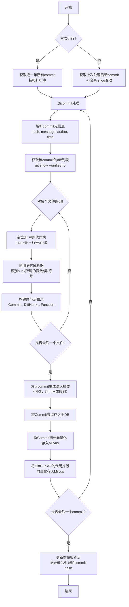

# chat

## 背景

```
我想把整个流程拆分为2个部分：一个是解析落库的部分。

另一个是用户使用，可能是 opencode 之类的 agent 使用时提供一个 skills。

让我们一步步来，先给我解析落库的核心流程+重难点+流程图
```

# 回答

## 一、解析落库核心流程

解析落库模块的目标：**将 Git 仓库的历史变更转化为结构化的图数据 + 向量索引**，供上层 Skills 实时查询。

### 1.1 整体流程（一次全量/增量运行）



### 1.2 关键子流程详解

#### ① 增量检测与历史一致性
- **常规增量**：记录 `last_commit_time` 和 `last_commit_hash`，下次执行 `git log --since=last_time` 获取新 commit（按时间顺序）。  
- **处理改写历史**：定期（如每天）对比 `git reflog` 中 default branch 的 commit 列表，若发现已存储的 commit 不在当前 reflog 中，标记为 `ORPHANED` 并删除其相关图数据。

#### ② 从 diff hunk 定位到函数/类
- **输入**：`git diff --unified=0` 输出的 hunk 头，例如 `@@ -10,7 +10,8 @@ def foo():`  
- **过程**：  
  1. 解析 hunk 头中的新旧行号范围。  
  2. 获取 commit 前后的完整文件内容（通过 `git show commit:path`）。  
  3. 对前后内容分别进行语法分析（AST），找出覆盖这些行号的**最内层语法节点**（函数、类、方法）。  
  4. 若节点未命名（如匿名函数），生成 `anon_func_{hash}_{line}` 标识。  
- **输出**：`Function` / `Class` 节点，属性包括：`name`, `signature`, `start_line`, `end_line`, `file_path`, `language`。

#### ③ 构建图关系
- 节点类型：`Commit`, `File`, `DiffHunk`, `Function`, `Class`, `Symbol`  
- 边类型：
  - `(:Commit)-[:CONTAINS]->(:DiffHunk)`
  - `(:DiffHunk)-[:CHANGES]->(:Function)`  (表示该 hunk 影响了这个函数)
  - `(:Commit)-[:MODIFIES]->(:File)`
  - `(:Function)-[:LOCATED_IN]->(:File)`
  - 静态关系（可选，但强烈建议）：`(:Function)-[:CALLS]->(:Function)`，通过额外的一次全量代码扫描获得。

#### ④ 向量化与存储
- **向量模型**：推荐 `codebert` 或 `voyage-2`（代码专用），或用 OpenAI `text-embedding-3-small`。  
- **Milvus Collection 设计**：
  - `commit_embeddings`：字段 `commit_hash`, `summary_text`（由 message + 变更文件列表生成）, `embedding`
  - `diffhunk_embeddings`：字段 `diff_id`, `code_snippet`（新代码部分）, `embedding`
- **图数据库**：Neo4j，为加速查询创建索引：
  ```cypher
  CREATE INDEX FOR (c:Commit) ON (c.hash);
  CREATE INDEX FOR (f:Function) ON (f.name, f.file_path);
  ```

---

## 二、重难点与解决方案

| 难点 | 原因 | 解决方案 |
|------|------|----------|
| **1. 函数边界识别跨语言** | 不同语言的 AST 差异大，且 diff 可能只改动函数中间几行 | 使用 Tree-sitter 作为统一解析库（支持 Python/Java/Go/Rust/JS 等），根据语言加载对应语法。对于无法解析的行，降级为“文件级”关系。 |
| **2. 文件重命名/移动** | `git diff` 默认不跟踪重命名，会导致函数归属错误 | 使用 `git log --follow` 获取文件重命名历史；在图数据库中维护 `File` 节点的 `previous_path` 属性，查询时自动沿路径回溯。 |
| **3. 大仓库性能** | 近一年可能有几万个 commit，逐个解析 diff 和 AST 耗时长 | - 并行处理 commit（注意保证拓扑顺序仅用于依赖，可分组并行）<br>- 缓存文件内容的 AST（同一文件在不同 commit 间复用解析结果）<br>- 使用增量模式，只处理新 commit。 |
| **4. 合并提交的噪音** | merge commit 的 diff 通常很大且包含大量无关变更 | 策略：默认**跳过 merge commit**（只处理普通 commit），但保留对 `--first-parent` 历史的主干追踪。若需要合并信息，单独标记 `MergeCommit` 节点并关联两个父分支的最后公共祖先。 |
| **5. 向量存储的实时性** | 每次增量后需更新 Milvus，但删除已废弃 commit 的向量较麻烦 | - 不在 Milvus 中物理删除，而是在图 DB 中标记 `is_active=false`，检索时过滤掉。<br>- 定期（每周）重建一次 Milvus collection 以清理孤儿向量。 |
| **6. 代码片段长度控制** | diff hunk 可能很大（如整个文件重写），导致 embedding 超过模型限制 | - 截断：保留 hunk 中前后各 30 行上下文，若超出 512 token 则只取变更行附近。<br>- 对超大 hunk，不直接 embedding，而是用 LLM 生成 1-2 句摘要再 embedding。 |

---

## 三、输出给下一阶段（Skills）的数据接口

解析落库完成后，对外提供两种查询接口（可以是 REST 或本地函数调用）：

### 3.1 图查询接口
```python
# 输入：当前文件路径 + 函数名（或行号）
# 输出：该函数的历史变更记录（commit 列表 + diff 片段）
get_function_history(file_path, function_name, limit=10)

# 输入：commit hash
# 输出：该 commit 影响的所有函数及对应的 diff 片段
get_commit_details(commit_hash)
```

### 3.2 向量检索接口
```python
# 输入：一段代码或自然语言描述
# 输出：Top-K 相似的 diff 片段 或 commit 摘要
vector_search(query_text, collection="diffhunk_embeddings", top_k=5)
```

### 3.3 变更影响面分析
```python
# 输入：一个函数节点 ID
# 输出：历史上与该函数同时被修改的其他函数（共现变更） + 调用链上的下游函数
get_impacted_functions(function_id, depth=2)
```

这些接口将被 Skills 调用，用于在编程时动态获取上下文。

---

## 四、流程图（纯文本版，便于嵌入文档）

```
+------------------+      +-------------------+      +-----------------+
|  Git Repository  |----->|  Incremental      |----->|  Parse Commit   |
|  (local clone)   |      |  Commit Fetcher   |      |  (git show)     |
+------------------+      +-------------------+      +--------+--------+
                                                              |
                                                              v
+------------------+      +-------------------+      +--------+--------+
|  Neo4j (Graph)   |<-----|  AST Parser       |<-----|  Diff Hunk      |
|  + Milvus (Vec)  |      |  (Tree-sitter)    |      |  Splitting      |
+------------------+      +-------------------+      +-----------------+
        ^                                                        |
        |                                                        v
        +--------------------------------------------------------+
                          (Store nodes & edges)
```

---

## 五、落地第一步建议

如果当前资源有限，可以先实现 **最小可行产品（MVP）**：

1. 仅支持 **一种语言**（如 Python）的 AST 解析。  
2. 只处理 **默认分支**，忽略分支合并逻辑。  
3. 图数据库用 **SQLite + 自定义关系表** 代替 Neo4j（简单，但查询复杂）。  
4. 向量库用 **Chroma**（轻量级，无需单独部署）。  
5. 增量更新只依赖 `git log --since`，暂不处理 rebase 导致的历史变动。

**验证目标**：能否回答“当前函数 `login()` 在过去一年中被修改过几次？每次修改影响了哪些其他函数？” 如果可行，再逐步增强。

# 参考资料

* any list
{:toc}