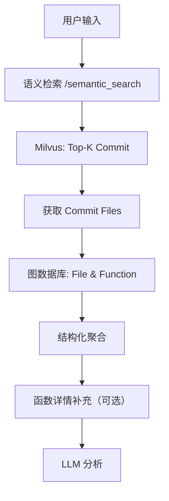
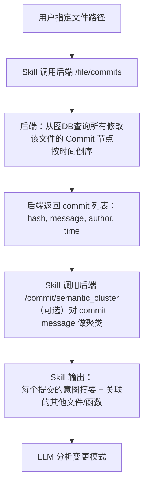

# chat

## 背景

```
另一个是用户使用，可能是 opencode 之类的 agent 使用时提供一个 skills。

现在给出在使用时的核心流程，为了保证稳定性，考虑 python 调用后端服务提供的 http 查询接口。

首先给出两个场景的查询流程：

1）一个功能涉及到历史的哪些文件（文件函数）。功能点-》提交==》文件  

2）一个文件被哪些提交（功能代你）修改？  

先给出查询的核心流程逻辑+流程图+重难点
```

# 回答


## 一、两个场景的核心查询流程

### 场景1：功能点 → 提交 → 文件/函数  
**用户输入**：自然语言描述（如“登录时的 token 刷新逻辑”）或一段代码片段。  
**目标**：找出历史上与这个功能相关的所有提交，以及这些提交修改的文件/函数。



**详细步骤**：
1. **Skill 接收功能描述**（字符串或代码片段）。
2. **语义检索**：调用 `POST /api/v1/semantic_search`，参数 `query` 和 `top_k=10`。后端将 query 向量化，在 Milvus 的 `commit_embeddings` 集合中检索，返回相似度最高的 commit hash 列表（附带相似度分数）。
3. **获取提交详情**：对每个 commit hash，调用 `GET /api/v1/commit/{hash}/files`。后端从图数据库（Neo4j）查询该 commit 关联的 `File` 节点和 `Function` 节点（通过 `Commit→Contains→DiffHunk→Changes→Function` 路径）。
4. **聚合与去重**：Skill 合并多个 commit 的结果，按文件路径去重，并记录每个文件/函数被修改的次数。
5. **（可选）获取函数源码**：若需要具体代码，调用 `GET /api/v1/function/{function_id}/source` 获取该函数的完整实现（当前最新版本或历史版本）。
6. **构造 prompt**：将 commit message、文件路径列表、函数签名列表（及可选源码）整理为结构化文本，交给 LLM 分析。

---

### 场景2：文件 → 提交（功能意图）  
**用户输入**：文件路径（如 `src/auth/login.java`）或当前打开文件的路径。  
**目标**：找出修改过该文件的所有提交，并按功能意图聚类（例如“修复 NPE”、“增加 OAuth 支持”）。



**详细步骤**：
1. **Skill 获取文件路径**（可从 IDE 当前焦点获得）。
2. **查询提交历史**：调用 `GET /api/v1/file/{file_path}/commits?limit=20`。后端在图数据库中执行查询：`MATCH (c:Commit)-[:MODIFIES]->(f:File {path: $path}) RETURN c ORDER BY c.time DESC`。
3. **扩展查询（可选）**：如果该文件已被重命名，后端需先通过 `File` 节点的 `previous_path` 链找到所有历史路径，再统一查询。
4. **语义聚类**：若返回的 commit 数量多（>5），Skill 可调用 `/api/v1/commit/cluster`，后端使用简单的 TF-IDF + K-means 或直接调用 LLM 对 commit message 进行主题聚类，输出几个功能簇（如“性能优化”、“Bug修复”、“新特性”）。
5. **关联影响面**：对每个关键 commit，可进一步调用 `/api/v1/commit/{hash}/functions` 获取该提交修改的函数，从而看出“修改这个文件的同时还动了哪些其他文件/函数”。
6. **返回给 LLM**：展示提交列表（按时间或聚类），附带每个提交的 message、修改的函数列表，让 LLM 总结该文件的演化规律。

---

## 二、后端 HTTP 接口设计（供 Skill 调用）

| 端点 | 方法 | 参数 | 返回 |
|------|------|------|------|
| `/api/v1/semantic_search` | POST | `{"query": str, "top_k": int}` | `[{"commit_hash": str, "score": float, "summary": str}]` |
| `/api/v1/commit/{hash}/files` | GET | `hash` | `{"files": [{"path": str, "functions": [{"id": str, "name": str}]}]}` |
| `/api/v1/file/{path}/commits` | GET | `path`, `limit` | `[{"hash": str, "message": str, "author": str, "time": str}]` |
| `/api/v1/commit/{hash}/functions` | GET | `hash` | `[{"function_id": str, "name": str, "file_path": str, "signature": str}]` |
| `/api/v1/function/{id}/source` | GET | `id` (可选参数 `commit_hash` 指定历史版本) | `{"source_code": str, "file_path": str, "line_range": [start,end]}` |
| `/api/v1/commit/cluster` | POST | `{"commits": [{"hash": str, "message": str}]}` | `{"clusters": [{"label": str, "commits": [hash]}]}` |

> 所有接口返回 JSON，错误时返回 `{"error": msg}` 及 HTTP 状态码。

---

## 三、Skill 侧的稳定调用策略（Python）

由于 Skill 运行在 opencode agent 环境中，需要保证健壮性：

```python
import httpx
from tenacity import retry, stop_after_attempt, wait_exponential

class GitHistorySkill:
    def __init__(self, base_url="http://localhost:8080"):
        self.client = httpx.Client(timeout=30.0, limits=httpx.Limits(max_keepalive_connections=5))

    @retry(stop=stop_after_attempt(3), wait=wait_exponential(multiplier=1, min=1, max=10))
    def semantic_search(self, query, top_k=5):
        try:
            resp = self.client.post(f"{self.base_url}/api/v1/semantic_search", json={"query": query, "top_k": top_k})
            resp.raise_for_status()
            return resp.json()
        except Exception as e:
            # 降级：返回空列表并记录日志
            print(f"Semantic search failed: {e}")
            return []

    def get_commits_for_file(self, file_path, limit=20):
        # 类似实现，带重试和超时
        ...
```

**降级策略**：
- 若向量检索服务不可用，Skill 可降级为基于 commit message 的关键词匹配（本地 grep 仓库的 `git log --grep`）。
- 若图数据库查询超时，返回部分结果并提示“历史记录不完整”。

---

## 四、重难点与解决方案

| 难点 | 原因 | 解决方案 |
|------|------|----------|
| **1. 功能点描述的语义歧义** | 用户说“登录功能”，可能对应多个不同命名（`login`, `signin`, `authenticate`） | - 向量检索时同时使用 commit message + diff 摘要，提高召回。<br>- 在 Skill 中增加二次精排：用 LLM 对检索到的 commit 列表进行相关性打分（仅对 top-20 做一次小模型调用）。 |
| **2. 文件重命名导致历史断裂** | 文件路径变了，但 `/file/{path}/commits` 只查当前路径，丢失旧记录 | - 后端维护 `File` 节点的 `previous_path` 链，查询时自动回溯所有曾用名。<br>- 或者在入库时，将所有 commit 关联的 File 节点都归一化到最终路径（通过 `git log --follow` 确定）。 |
| **3. 大量提交返回，token 爆炸** | 一个文件可能有几百次提交，全部返回给 LLM 不可行 | - Skill 端默认只返回最近 10 条，并提供分页参数。<br>- 支持时间范围过滤（如 `?since=2025-01-01`）。<br>- 对 message 做聚类，每个簇只展示代表提交。 |
| **4. 提交中修改的函数跨多个文件** | 一个提交改了 5 个文件 20 个函数，但用户只关心当前文件 | - 接口 `/commit/{hash}/files` 默认只返回该提交影响的**所有**文件和函数，由 Skill 按当前文件过滤。<br>- 增加参数 `?filter_file=path` 仅返回与指定文件相关的函数。 |
| **5. 实时性 vs 资源消耗** | 每次查询都实时从图 DB 拉取数据，高并发下压力大 | - 后端加 Redis 缓存：对 `file/commits` 和 `commit/files` 结果缓存 5 分钟。<br>- 对于语义检索，使用 Milvus 自身的高并发能力，无需额外缓存。 |
| **6. 跨分支查询** | 默认分支的历史可能不包含某个功能第一次引入的分支提交 | - 在入库时只处理默认分支（`main`），但可以通过 `git branch --contains <commit>` 识别出那些最终合并到默认分支的提交（即 `git log --first-parent` 能看到的）。<br>- 若用户需要全部分支历史，需在接口中增加 `?branch=all` 参数，后端动态从仓库解析。 |

---

## 五、流程图（纯文本版）

### 场景1 流程
```
[用户] --> "修复登录超时问题" (自然语言)
          |
          v
[Skill] --> POST /semantic_search
          |
          v
[Backend] --> 向量检索 Milvus --> 返回 ["abc123", "def456"]
          |
          v
[Skill] --> GET /commit/abc123/files --> {files: ["auth.py"], functions: ["login", "refresh_token"]}
[Skill] --> GET /commit/def456/files --> {files: ["auth.py", "utils.py"], functions: ["validate"]}
          |
          v
[Skill] --> 聚合结果，构造 prompt:
          "相关提交: abc123 (修复 token 过期), 修改了 auth.py 中的 login() 和 refresh_token()
                     def456 (增加超时重试), 修改了 utils.py 中的 validate()"
          |
          v
[LLM]   --> 分析：login() 的历史变更集中在 token 刷新逻辑...
```

### 场景2 流程
```
[用户] --> 当前文件 "src/auth/login.py"
          |
          v
[Skill] --> GET /file/src/auth/login.py/commits?limit=10
          |
          v
[Backend] --> 图DB查询 --> 返回 10 个 commit（按时间倒序）
          |
          v
[Skill] --> POST /commit/cluster (对 message 聚类)
          |
          v
[Backend] --> 返回聚类: ["OAuth 支持" (2个commit), "Bug修复" (5个commit), "性能优化" (3个commit)]
          |
          v
[Skill] --> 对每个簇选择代表 commit，调用 /commit/abc123/functions 获取修改函数
          |
          v
[Skill] --> 输出给 LLM:
          "login.py 近一年主要有三类修改:
           1. OAuth 支持 (2025-02-10): 增加了 authenticate_oauth()，修改了 login()
           2. Bug修复 (2025-01-20): 修复了空指针异常，影响 get_user()
           ..."
```

---

## 六、总结

- **核心思路**：Skill 作为轻量级编排层，通过 HTTP 调用后端服务获取结构化历史数据，避免在 agent 内部处理复杂的图查询和向量检索。
- **稳定性保障**：重试、超时、降级、缓存。
- **扩展性**：接口设计以 commit hash 和函数 ID 为纽带，可逐步增加更多分析能力（如影响面扩散、代码变更模式挖掘）。


# 参考资料

* any list
{:toc}