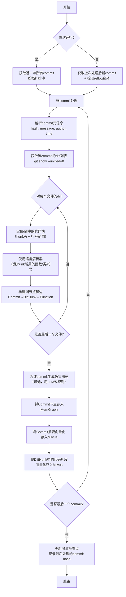
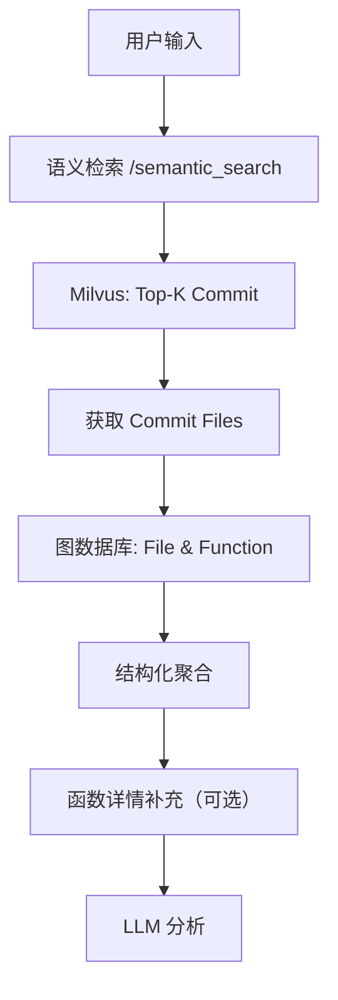
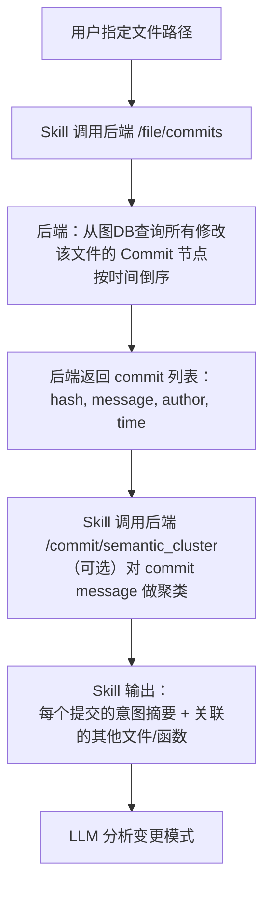

# 背景

```
通过代码仓库的 git log 提交历史，然后在编程的时候，提供一个 skills（可以理解每一个文件和变更之间的隐形的知识关系，先让 LLM 理解）。

思路是定时扫描仓库近一年的 git history，初次全量，后续增量。 

然后构建git histiry 的提交与文件的图数据关系，额外加上 mivlus 向量库对提交的语义检索。 

使用时，可以通过语义检索---》拿到提交--》拿到文件 

然后让 LLM 分析这些文件，分析对应的关系
```

# 核心流程

## 解析落库

解析落库模块的目标：**将 Git 仓库的历史变更转化为结构化的图数据 + 向量索引**，供上层 Skills 实时查询。



## 查询流程

### 场景1：功能点 → 提交 → 文件/函数
**用户输入**：自然语言描述（如“登录时的 token 刷新逻辑”）或一段代码片段。  
**目标**：找出历史上与这个功能相关的所有提交，以及这些提交修改的文件/函数。



**详细步骤**：
1. **Skill 接收功能描述**（字符串或代码片段）。
2. **语义检索**：调用 `POST /api/v1/semantic_search`，参数 `query` 和 `top_k=10`。后端将 query 向量化，在 Milvus 的 `commit_embeddings` 集合中检索，返回相似度最高的 commit hash 列表（附带相似度分数）。
3. **获取提交详情**：对每个 commit hash，调用 `GET /api/v1/commit/{hash}/files`。后端从图数据库（Neo4j）查询该 commit 关联的 `File` 节点和 `Function` 节点（通过 `Commit→Contains→DiffHunk→Changes→Function` 路径）。
4. **聚合与去重**：Skill 合并多个 commit 的结果，按文件路径去重，并记录每个文件/函数被修改的次数。
5. **（可选）获取函数源码**：若需要具体代码，调用 `GET /api/v1/function/{function_id}/source` 获取该函数的完整实现（当前最新版本或历史版本）。
6. **构造 prompt**：将 commit message、文件路径列表、函数签名列表（及可选源码）整理为结构化文本，交给 LLM 分析。

---

### 场景2：文件 → 提交（功能意图）
**用户输入**：文件路径（如 `src/auth/login.java`）或当前打开文件的路径。  
**目标**：找出修改过该文件的所有提交，并按功能意图聚类（例如“修复 NPE”、“增加 OAuth 支持”）。



**详细步骤**：
1. **Skill 获取文件路径**（可从 IDE 当前焦点获得）。
2. **查询提交历史**：调用 `GET /api/v1/file/{file_path}/commits?limit=20`。后端在图数据库中执行查询：`MATCH (c:Commit)-[:MODIFIES]->(f:File {path: $path}) RETURN c ORDER BY c.time DESC`。
3. **扩展查询（可选）**：如果该文件已被重命名，后端需先通过 `File` 节点的 `previous_path` 链找到所有历史路径，再统一查询。
4. **语义聚类**：若返回的 commit 数量多（>5），Skill 可调用 `/api/v1/commit/cluster`，后端使用简单的 TF-IDF + K-means 或直接调用 LLM 对 commit message 进行主题聚类，输出几个功能簇（如“性能优化”、“Bug修复”、“新特性”）。
5. **关联影响面**：对每个关键 commit，可进一步调用 `/api/v1/commit/{hash}/functions` 获取该提交修改的函数，从而看出“修改这个文件的同时还动了哪些其他文件/函数”。
6. **返回给 LLM**：展示提交列表（按时间或聚类），附带每个提交的 message、修改的函数列表，让 LLM 总结该文件的演化规律。


