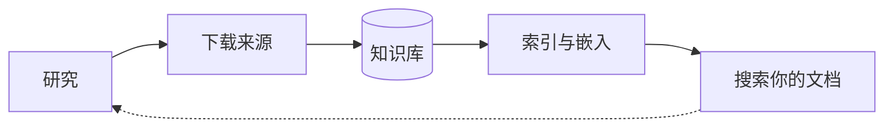
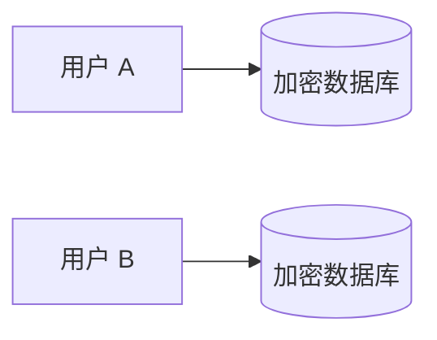

# 本地深度研究

AI 赋能的研究助手，用于深度、自主性的研究

使用多种 LLM 和搜索引擎进行深度、自主性研究，并提供规范的引用

## 🚀 什么是本地深度研究？

一个由你控制的 AI 研究助手。在本地运行以保护隐私，可以使用任何 LLM，并构建你自己的、可搜索的知识库。

你拥有自己的数据，并能确切地了解它的工作原理。

## ⚡ 快速开始

**选项 1：Docker 运行 (Linux)**
```bash
# 步骤 1：拉取并运行 Ollama
docker run -d -p 11434:11434 --name ollama ollama/ollama
docker exec ollama ollama pull gpt-oss:20b

# 步骤 2：拉取并运行 SearXNG 以获得最佳搜索结果
docker run -d -p 8080:8080 --name searxng searxng/searxng

# 步骤 3：拉取并运行 Local Deep Research
docker run -d -p 5000:5000 --network host \
  --name local-deep-research \
  --volume "deep-research:/data" \
  -e LDR_DATA_DIR=/data \
  localdeepresearch/local-deep-research
```

**选项 2：Docker Compose**

仅 CPU (所有平台):
```bash
curl -O https://raw.githubusercontent.com/LearningCircuit/local-deep-research/main/docker-compose.yml && docker compose up -d
```

带 NVIDIA GPU (Linux):
```bash
curl -O https://raw.githubusercontent.com/LearningCircuit/local-deep-research/main/docker-compose.yml && \
curl -O https://raw.githubusercontent.com/LearningCircuit/local-deep-research/main/docker-compose.gpu.override.yml && \
docker compose -f docker-compose.yml -f docker-compose.gpu.override.yml up -d
```

大约 30 秒后打开 `http://localhost:5000`。关于 GPU 设置、环境变量等更多信息，请参阅 [Docker Compose 指南](https://github.com/LearningCircuit/local-deep-research/blob/main/docs/DOCKER_COMPOSE.md)。

**选项 3：pip 安装**
```bash
pip install local-deep-research
```
适用于 Windows、macOS 和 Linux。SQLCipher 加密通过预构建的 wheel 包包含在内——无需编译。
Windows 上的 PDF 导出需要 Pango（[设置指南](https://github.com/LearningCircuit/local-deep-research/blob/main/docs/PDF_EXPORT.md)）。
如果你在加密方面遇到问题，设置 `export LDR_BOOTSTRAP_ALLOW_UNENCRYPTED=true` 以使用标准 SQLite。

## 🏗️ 工作原理

### 研究过程

你提出一个复杂的问题。LDR 会：
- 自动为你进行研究
- 搜索网络、学术论文和你自己的文档
- 将所有内容整合成一份带有适当引用的报告

你可以从 20 多种研究策略中选择，用于快速事实核查、深度分析或学术研究。

**新功能：LangGraph 智能体策略** — 一种自主的智能体研究模式，由 LLM 决定搜索什么、使用哪些专用搜索引擎（arXiv、PubMed、Semantic Scholar 等）以及何时进行综合分析。早期结果令人振奋——它能根据搜索结果自适应地在搜索引擎之间切换，并比基于管道的策略收集到更多的来源。在“设置”中选择 `langgraph-agent` 进行尝试。

### 构建你的知识库



每次研究会话都会发现有价值的来源。你可以直接将它们下载到你的加密知识库中——来自 ArXiv 的学术论文、PubMed 的文章、网页。LDR 会提取文本、索引所有内容并使其可搜索。下次研究时，你可以同时在自己的文档和实时网络上提问。你的知识会随着时间的推移而不断累积。

## 🛡️ 安全性



你的数据永远属于你。每个用户都有自己独立的、使用 AES-256 加密（Signal 级别安全）的 SQLCipher 隔离数据库。没有密码恢复功能意味着真正的零知识——即使是服务器管理员也无法读取你的数据。使用 Ollama + SearXNG 完全在本地运行，数据永远不会离开你的机器。

**内存中的凭据**：与所有在运行时使用密钥的应用程序（包括密码管理器、浏览器和 API 客户端）一样，在活动会话期间，凭据以明文形式保存在进程内存中。这是全行业公认的现实，并非 LDR 特有：如果攻击者可以读取进程内存，他们也可以读取任何正在使用的解密密钥。我们通过会话范围的凭据生命周期和排除核心转储来缓解此问题。我们始终欢迎通过 GitHub Issues 提出进一步的改进想法。详情请参阅我们的[安全政策](https://github.com/LearningCircuit/local-deep-research/blob/main/SECURITY.md)。

**供应链安全**：Docker 镜像使用 Cosign 签名，包含 SLSA 来源证明，并附带 SBOM。验证命令：
```bash
cosign verify localdeepresearch/local-deep-research:latest
```

**安全透明度**：扫描器的抑制项已在 [安全警报评估](https://github.com/LearningCircuit/local-deep-research/blob/main/docs/SECURITY_ALERTS_ASSESSMENT.md)、[Scorecard 合规性](https://github.com/LearningCircuit/local-deep-research/blob/main/docs/SCORECARD_COMPLIANCE.md)、[容器 CVE 抑制项](https://github.com/LearningCircuit/local-deep-research/blob/main/docs/CONTAINER_CVE_SUPPRESSIONS.md) 和 [SAST 规则说明](https://github.com/LearningCircuit/local-deep-research/blob/main/docs/SAST_RULE_RATIONALE.md) 中记录并说明了理由。某些警报（Dependabot、代码扫描）只能被关闭，或在 GitHub 安全选项卡之外极难抑制，因此上述文件并未涵盖每一个被关闭的发现。

### 🔒 隐私与数据

Local Deep Research **不包含**任何遥测、分析或跟踪功能。我们不会收集、传输或存储任何关于你或你使用情况的数据。没有分析 SDK，没有“打电话回家”的调用，没有崩溃报告，没有外部脚本。使用指标会留在你本地的加密数据库中。

LDR 发出的唯一网络调用是你主动发起的：搜索查询（发给您配置的搜索引擎）、LLM API 调用（发给您选择的提供商）以及通知（仅当您设置了 Apprise 时）。

由于我们不收集任何使用数据，我们需要您告诉我们哪些功能有效、哪些出了问题、以及您接下来希望看到什么——错误报告、功能创意，甚至您喜欢或从不使用的功能，都能帮助我们改进 LDR。

## 📊 性能

在 SimpleQA 基准测试上达到 **约 95% 的准确率**（初步结果）
- 使用 GPT-4.1-mini + SearXNG + focused-iteration 策略测试
- 与最先进的 AI 研究系统性能相当
- 通过正确配置，本地模型也可以达到类似的性能

### 🧭 选模型？参考社区基准测试

不确定用哪个本地模型运行 LDR？社区维护的 **Hugging Face LDR 基准测试数据集** 跟踪了不同模型、搜索引擎和研究策略的准确率——在你下载数 GB 的权重文件之前，这是快速了解哪些 Ollama / LM Studio / llama.cpp 模型能真正做好深度研究的最快途径。

## ✨ 主要功能

### 🔍 研究模式
- **快速总结** - 在 30 秒到 3 分钟内获得带引用的答案
- **详细研究** - 带有结构化发现项的全面分析
- **报告生成** - 带章节和目录的专业报告
- **文档分析** - 使用 AI 搜索你的私有文档

### 🛠️ 高级能力
- **LangChain 集成** - 使用任何向量存储作为搜索引擎
- **REST API** - 支持每用户数据库的认证 HTTP 访问
- **基准测试** - 测试和优化你的配置
- **分析仪表盘** - 跟踪成本、性能和使用指标
- **期刊质量系统** - 自动期刊声誉评分，包含 21.2 万+ 索引源、掠夺性期刊检测和质量仪表盘。由 OpenAlex (CC0)、DOAJ (CC0) 和 Stop Predatory Journals (MIT) 提供支持。
- **实时更新** - 支持 WebSocket，用于实时研究进度
- **导出选项** - 将结果下载为 PDF 或 Markdown
- **研究历史** - 保存、搜索和重温过去的研究
- **自适应速率限制** - 学习最优等待时间的智能重试系统
- **键盘快捷键** - 高效导航 (ESC, Ctrl+Shift+1-5)
- **每用户加密数据库** - 安全、隔离的每个用户数据存储

### 📰 新闻与研究订阅
- **自动化研究摘要** - 订阅主题，接收 AI 生成的研究摘要
- **可自定义频率** - 每日、每周或自定义计划进行研究更新
- **智能过滤** - AI 过滤并仅总结最相关的发展
- **多格式交付** - 以 Markdown 报告或结构化摘要的形式获取更新
- **主题与查询支持** - 跟踪特定搜索或广泛研究领域

### 🌐 搜索来源

#### 免费搜索引擎
- **学术**: arXiv, PubMed, Semantic Scholar
- **通用**: Wikipedia, SearXNG
- **技术**: GitHub, Elasticsearch
- **历史**: Wayback Machine
- **新闻**: The Guardian, Wikinews

#### 付费搜索引擎
- **Tavily** - AI 驱动的搜索
- **Google** - 通过 SerpAPI 或 Programmable Search Engine
- **Brave Search** - 注重隐私的网络搜索

#### 自定义来源
- **本地文档** - 使用 AI 搜索你的文件
- **LangChain 检索器** - 任何向量存储或数据库
- **元搜索** - 智能组合多个搜索引擎

LDR 在抓取网页时尊重 `robots.txt` 并诚实地标识自己——没有隐身或反检测技术。在极少数情况下，这意味着一个阻止自动化访问的页面将不会被获取，我们认为这是一个正确的权衡。

## 📦 安装选项

对于大多数用户来说，上面的“快速开始”就足够了。

| 方法 | 最适合 | 指南 |
|---|---|---|
| Docker Compose | 大多数用户（推荐） | [Docker Compose 指南](docs/DOCKER_COMPOSE.md) |
| Docker | 最小化设置 | [安装指南](docs/INSTALLATION.md) |
| pip | 开发者, Python 集成 | [pip 指南](docs/PIP_SETUP.md) |
| Unraid | Unraid 服务器 | [Unraid 指南](docs/UNRAID_SETUP.md) |

## 💻 使用示例

### Python API
```python
from local_deep_research.api import LDRClient, quick_query

# 选项 1：最简单 - 一行代码研究
summary = quick_query("用户名", "密码", "什么是量子计算？")
print(summary)

# 选项 2：用于多个操作的客户端
client = LDRClient()
client.login("用户名", "密码")
result = client.quick_research("量子计算有哪些最新进展？")
print(result["summary"])
```

### HTTP API

下面的代码示例展示了基本的 API 结构 - 完整的工作示例请参见下面的链接
```python
import requests
from bs4 import BeautifulSoup

# 创建会话并认证
session = requests.Session()
login_page = session.get("http://localhost:5000/auth/login")
soup = BeautifulSoup(login_page.text, "html.parser")
login_csrf = soup.find("input", {"name": "csrf_token"}).get("value")

# 登录并获取 API CSRF 令牌
session.post("http://localhost:5000/auth/login",
            data={"username": "user", "password": "pass", "csrf_token": login_csrf})
csrf = session.get("http://localhost:5000/auth/csrf-token").json()["csrf_token"]

# 发起 API 请求
response = session.post("http://localhost:5000/api/start_research",
                       json={"query": "你的研究问题"},
                       headers={"X-CSRF-Token": csrf})
```
- ✅ 自动创建用户 - 开箱即用
- ✅ 包含 CSRF 处理的完整认证
- ✅ 结果重试逻辑 - 等待研究完成
- ✅ 进度监控和错误处理

### 命令行工具
```bash
# 从命令行运行基准测试
python -m local_deep_research.benchmarks --dataset simpleqa --examples 50

# 管理速率限制
python -m local_deep_research.web_search_engines.rate_limiting status
python -m local_deep_research.web_search_engines.rate_limiting reset
```

## 🔗 企业集成

将 LDR 连接到你现有的知识库：
```python
from local_deep_research.api import quick_summary

# 使用你现有的 LangChain 检索器
result = quick_summary(
    query="我们的部署流程是什么？",
    retrievers={"company_kb": your_retriever},
    search_tool="company_kb"
)
```
适用于：FAISS、Chroma、Pinecone、Weaviate、Elasticsearch 以及任何与 LangChain 兼容的检索器。

## 🔌 MCP 服务器（Claude 集成）

LDR 提供了一个 MCP（模型上下文协议）服务器，允许像 Claude Desktop 和 Claude Code 这样的 AI 助手进行深度研究。

> **⚠️ 安全提示**：此 MCP 服务器设计为仅通过 STDIO 传输（例如 Claude Desktop）进行本地使用。它没有内置的身份验证或速率限制。**请勿**在没有实施适当安全控制的情况下通过网络暴露它。请参阅 [MCP 安全指南](docs/MCP_SECURITY.md) 了解网络部署要求。

### 安装
```bash
# 使用 MCP 额外组件安装
pip install "local-deep-research[mcp]"
```

### Claude Desktop 配置

添加到你的 `claude_desktop_config.json`:
```json
{
  "mcpServers": {
    "local-deep-research": {
      "command": "ldr-mcp",
      "env": {
        "LDR_LLM_PROVIDER": "openai",
        "LDR_LLM_OPENAI_API_KEY": "sk-..."
      }
    }
  }
}
```

### Claude Code 配置

添加到你的 `.mcp.json`（项目级）或 `~/.claude/mcp.json`（全局）：
```json
{
  "mcpServers": {
    "local-deep-research": {
      "command": "ldr-mcp",
      "env": {
        "LDR_LLM_PROVIDER": "ollama",
        "LDR_LLM_OLLAMA_URL": "http://localhost:11434"
      }
    }
  }
}
```

### 可用工具

| 工具 | 描述 | 耗时 | LLM 成本 |
|---|---|---|---|
| `search` | 来自特定引擎（arxiv, pubmed, wikipedia, ...）的原始结果 | 5-30秒 | 无 |
| `quick_research` | 快速研究总结 | 1-5 分钟 | 有 |
| `detailed_research` | 综合分析 | 5-15 分钟 | 有 |
| `generate_report` | 完整的 Markdown 报告 | 10-30 分钟 | 有 |
| `analyze_documents` | 搜索本地收藏集 | 30秒-2分钟 | 有 |
| `list_search_engines` | 列出可用的搜索引擎 | 即时 | 无 |
| `list_strategies` | 列出研究策略 | 即时 | 无 |
| `get_configuration` | 获取当前配置 | 即时 | 无 |

### 单独使用搜索引擎

`search` 工具允许你直接查询特定的搜索引擎并获取原始结果（标题、链接、摘要）——无需 LLM 处理，零成本，速度快。这对于监控和订阅尤其有用，你想定期检查新内容而无需消耗 LLM 的 token。
```python
# 搜索 arXiv 上的最新论文
search(query="transformer architecture improvements", engine="arxiv")

# 搜索 PubMed 上的医学文献
search(query="CRISPR clinical trials 2024", engine="pubmed")

# 搜索 Wikipedia 上的快速事实
search(query="quantum error correction", engine="wikipedia")

# 搜索 OpenClaw 上的判例法
search(query="copyright fair use precedents", engine="openclaw")

# 使用 list_search_engines() 查看所有可用的引擎
```

### 使用示例
```
"使用 quick_research 查找关于量子计算应用的信息"
"搜索 arxiv 上关于扩散模型的最新论文"
"生成一份关于可再生能源趋势的详细研究报告"
```

## 📊 性能与分析

### 基准测试结果

在小型 SimpleQA 数据集样本上的早期实验：

| 配置 | 准确率 | 备注 |
|---|---|---|
| gpt-4.1-mini + SearXNG + focused_iteration | 90-95% | 样本量有限 |
| gpt-4.1-mini + Tavily + focused_iteration | 90-95% | 样本量有限 |
| gemini-2.0-flash-001 + SearXNG | 82% | 单次测试运行 |

**注意**：这些是初步测试的早期结果。性能会因查询类型、模型版本和配置而有显著差异。请[运行你自己的基准测试](https://github.com/LearningCircuit/local-deep-research/blob/main/docs/BENCHMARKING.md)。

**完整的社区排行榜**：社区在一个专门的仓库中维护着不断增长的、跨模型、策略和搜索引擎的基准测试结果集合，支持 CI 验证的提交和自动生成的排行榜：
- **GitHub**: [LearningCircuit/ldr-benchmarks](https://github.com/LearningCircuit/ldr-benchmarks) — 在此提交你的结果
- **Hugging Face**: [local-deep-research/ldr-benchmarks](https://huggingface.co/datasets/local-deep-research/ldr-benchmarks) — 浏览排行榜并下载 CSV 文件

### 基准测试贡献者

感谢为基准测试运行做出贡献的社区成员：...（名单在原 README 中列出，此处略）

### 内置分析仪表盘

通过详细的指标跟踪成本、性能和使用情况。[了解更多](https://github.com/LearningCircuit/local-deep-research/blob/main/docs/ANALYTICS_DASHBOARD.md)。

## 🤖 支持的 LLM

### 本地模型
- **Ollama** — 连接到其原生 API（默认 `http://localhost:11434`）
- **LM Studio** — 连接到其 OpenAI 兼容服务器（默认 `http://localhost:1234/v1`）
- **llama.cpp** — 连接到 `llama-server` 的 OpenAI 兼容端点（默认 `http://localhost:8080/v1`）；使用 `llama-server -m <model.gguf>` 启动
- **常见模型**：Llama 3, Mistral, Gemma, DeepSeek, Qwen
- LLM 处理保持在本地（搜索查询仍然发往网络）。**无 API 成本**。

💡 **我应该选择哪个本地模型？** 查看 Hugging Face 上的 [LDR 基准测试数据集](https://huggingface.co/datasets/local-deep-research/ldr-benchmarks) —— 社区提交的本地和云端模型准确率数据，让你在下载前可以比较。也可以访问 [GitHub](https://github.com/LearningCircuit/ldr-benchmarks) 来提交你自己的运行结果。

### 云端模型
- **OpenAI** (GPT-4o, GPT-4.1-mini, GPT-3.5)
- **Anthropic** (Claude 3)
- **Google** (Gemini)
- 通过 **OpenRouter** 可使用 100+ 模型

### 从早期版本升级的注意事项
- `llm.model` 不再有默认值。在 1.7 版本之前的安装中，当没有配置模型时，会自动填入 `gemma3:12b` (Ollama)，这会静默下载一个数 GB 的二进制文件。现在该字段默认为空——请在“设置” → “LLM”中选择一个模型，否则研究将明确报错而失败。
- `llamacpp` 提供程序现在使用 HTTP 而非进程内加载。如果你之前设置了 `llm.llamacpp_model_path` 指向一个本地的 `.gguf` 文件，该设置将不再生效。相反，请运行 `llama-server -m <your-model.gguf>`（它随每个现代 llama.cpp 构建版一同提供），默认的 `llm.llamacpp.url` (http://localhost:8080/v1) 会连接它。如果你将 `llama-server` 放在认证代理后面，可通过 `llm.llamacpp.api_key` 支持可选的 API 密钥。

## 📚 文档

### 入门指南
- [快速开始](https://github.com/LearningCircuit/local-deep-research/blob/main/docs/QUICKSTART.md)
- [Docker Compose 指南](https://github.com/LearningCircuit/local-deep-research/blob/main/docs/DOCKER_COMPOSE.md)
- [安装指南](https://github.com/LearningCircuit/local-deep-research/blob/main/docs/INSTALLATION.md)

### 核心功能
- [研究策略](https://github.com/LearningCircuit/local-deep-research/blob/main/docs/RESEARCH_STRATEGIES.md)
- [知识库管理](https://github.com/LearningCircuit/local-deep-research/blob/main/docs/KNOWLEDGE_BASE.md)
- [新闻与研究订阅](https://github.com/LearningCircuit/local-deep-research/blob/main/docs/SUBSCRIPTIONS.md)

### 高级功能
- [MCP 服务器集成](https://github.com/LearningCircuit/local-deep-research/blob/main/docs/MCP_SERVER.md)
- [REST API 参考](https://github.com/LearningCircuit/local-deep-research/blob/main/docs/API_REFERENCE.md)
- [基准测试与分析](https://github.com/LearningCircuit/local-deep-research/blob/main/docs/BENCHMARKING.md)
- [期刊质量系统](https://github.com/LearningCircuit/local-deep-research/blob/main/docs/JOURNAL_QUALITY.md)

### 开发
- [贡献指南](https://github.com/LearningCircuit/local-deep-research/blob/main/CONTRIBUTING.md)
- [本地开发设置](https://github.com/LearningCircuit/local-deep-research/blob/main/docs/DEVELOPMENT.md)
- [安全政策](https://github.com/LearningCircuit/local-deep-research/blob/main/SECURITY.md)

### 示例与教程
- [LangGraph 智能体策略示例](https://github.com/LearningCircuit/local-deep-research/blob/main/examples/langgraph_agent) - 演示自主研究
- [LangChain 检索器集成](https://github.com/LearningCircuit/local-deep-research/blob/main/examples/langchain_retrievers) - 连接外部知识库
- [自定义搜索引擎](https://github.com/LearningCircuit/local-deep-research/blob/main/examples/custom_search_engines) - 添加你自己的搜索源

## 📰 媒体报道与收录

> “Local Deep Research 对于那些优先考虑隐私的人来说值得特别提及……它能调整使用可以在消费级 GPU 甚至 CPU 上运行的开源 LLM。记者、研究人员或处理敏感话题的公司可以调查信息，而无需将查询发送到外部服务器。”

### 新闻与文章
- **Korben.info** - 法国科技博客（“数字版夏洛克·福尔摩斯”）
- **Roboto.fr** - “OpenAI 深度研究的免费开源替代品”
- **KDJingPai AI 工具** - AI 生产力工具报道
- **AI 分享圈** - AI 资源报道

### 社区讨论
- **Hacker News** - 190+ 积分，社区讨论
- **LangChain Twitter/X** - 官方 LangChain 推广
- **LangChain LinkedIn** - 400+ 点赞

### 国际报道
#### 🇨🇳 中文
- **掘金** - 开发者社区
- **博客园** - 开发者博客
- **GitHubDaily** - 有影响力的技术账号
- **知乎** - 技术社区
- **A姐分享** - AI 资源
- **CSDN** - 安装指南
- **网易** - 科技新闻门户

#### 🇯🇵 日文
- **note.com**: 調査革命：Local Deep Research徹底活用法 - 综合教程
- **Qiita**: Local Deep Researchを試す - Docker 设置指南
- **LangChainJP** - 日本 LangChain 社区

#### 🇰🇷 韩文
- **PyTorch Korea 论坛** - 韩国机器学习社区
- **GeekNews (Hada.io)** - 韩国科技新闻

### 评测与分析
- **BSAIL 实验室**: [深度研究在学术中有多大用处？](https://bsail.github.io/blog/2025/02/13/how-useful-is-deep-research-in-academia.html) - 贡献者 @djpetti 的学术评论
- **The Art Of The Terminal**: [现在就开始使用本地 LLM！](https://artoftheterminal.substack.com/p/use-local-llms-already) - 对本地 AI 工具的全面评测，重点介绍了 LDR 的研究能力（嵌入功能现已可用！）

### 相关项目
- **SearXNG LDR-Academic** - 面向学术的 SearXNG 分支，包含 12 个研究引擎（arXiv, Google Scholar, PubMed 等），专为 LDR 设计
- **DeepWiki 文档** - 第三方文档和指南

**注意**：第三方项目和文章由各自独立维护。我们将其作为有用资源进行链接，但无法保证其代码质量或安全性。

## 🤝 社区与支持
- **Discord** - 获取帮助和分享研究技巧
- **Reddit** - 更新和展示
- **GitHub Issues** - 错误报告

## 🚀 贡献指南

我们欢迎各种规模的贡献——从修复拼写错误到添加新功能。关键规则是：保持 PR **小而原子化**（每个 PR 只做一项更改）。对于较大的更改，请先开启一个 issue 或发起讨论——我们希望你投入的时间是值得的，并最终能被成功合并，而不是因为方向不对而被拒绝。请参阅我们的[贡献指南](https://github.com/LearningCircuit/local-deep-research/blob/main/CONTRIBUTING.md)开始。

## 致谢

Local Deep Research 建立在许多开放获取计划、学术数据库和开源项目的工作之上。我们感谢：

### 学术与研究数据
| 来源 | 提供内容 | 许可证 |
|---|---|---|
| OpenAlex | 约 28 万个来源和约 12 万个机构（包括 DOAJ 状态）的学术元数据 | CC0 |
| DOAJ | 开放获取期刊目录——开放获取验证（通过 OpenAlex） | CC0 |
| arXiv | 物理学、数学、计算机科学等领域的预印本 | 多种（见 arXiv 许可证） |
| PubMed / NCBI | 生物医学和生命科学文献 | 公共领域（美国政府） |
| Semantic Scholar | 跨学科学术搜索，含引用数据 | [条款](https://www.semanticscholar.org/product/terms) |
| NASA ADS | 天体物理学、物理学和天文学论文 | [条款](https://ui.adsabs.harvard.edu/help/terms/) |
| Zenodo | 开放研究数据、数据集和软件 | 每条记录不同 |
| PubChem | 化学和生物化学数据库 | 公共领域（美国政府） |
| Stop Predatory Journals | 掠夺性期刊/出版商黑名单 | MIT |
| JabRef | 期刊缩写数据库 | CC0 |

### 知识内容来源
- Wikipedia / 维基媒体基金会 - 自由百科全书 (CC BY-SA)
- The Guardian - 新闻内容 (经许可)
- GitHub - 代码仓库和开发者文档 (各自许可证)
- Internet Archive (Wayback Machine) - 网页历史存档 (各自许可证)

### 基础设施与框架
- **Ollama** - 本地 LLM 运行与分发 (MIT)
- **SearXNG** - 私有元搜索引擎 (AGPL)
- **LangChain / LangGraph** - LLM 应用开发框架 (MIT)
- **SQLCipher** - SQLite 加密扩展 (BSD)
- **Flask** - Web 框架 (BSD)
- **Pydantic** - 数据验证 (MIT)
- **Poetry** - 依赖管理 (MIT)

### 支持开放获取

这些项目依赖捐赠和资助运行，而非付费墙。如果 Local Deep Research 对你有所帮助，请考虑回馈使其成为可能的开放获取生态系统：
- **arXiv** — 为物理学、数学、计算机科学等领域免费提供预印本
- **PubMed / NLM** — 开放的生物医学文献
- **Wikipedia / 维基媒体** — 自由的百科全书
- **Internet Archive** — 时光机和开放数字图书馆
- **DOAJ** — 在全球范围内策划和验证开放获取期刊
- **OpenAlex** — 开放的学术元数据（由 OurResearch 赞助）
- **Project Gutenberg** — 自 1971 年起提供免费电子书

## 📄 许可证

MIT 许可证 - 请参阅 [LICENSE](https://github.com/LearningCircuit/local-deep-research/blob/main/LICENSE) 文件。

**依赖项**：所有第三方包均使用宽松许可证（MIT、Apache-2.0、BSD 等）- 请参阅 [allowlist](https://github.com/LearningCircuit/local-deep-research/blob/main/docs/DEPENDENCY_LICENSE_ALLOWLIST.md)

# 参考资料

* any list
{:toc}