# TabPFN

## 快速开始

### 交互式 Notebook 教程

**提示**

直接使用我们的交互式 Colab notebook 来快速上手！这是亲身体验 TabPFN 的最佳方式，它将引导您完成安装、分类和回归示例。

**⚡ 推荐使用 GPU：**
为了获得最佳性能，请使用 GPU（即使是具有约 8GB 显存的旧显卡也能很好地工作；一些大型数据集需要 16GB 显存）。
在 CPU 上，仅能处理小型数据集（≲1000 个样本）。
没有 GPU？请通过 [TabPFN Client](https://github.com/PriorLabs/tabpfn-client) 使用我们的免费托管推理服务。

### 安装

**官方安装 (pip)**
```bash
pip install tabpfn
```

**或者从源码安装**
```bash
pip install "tabpfn @ git+https://github.com/PriorLabs/TabPFN.git"
```

**或者本地开发安装：** 首先安装我们用于开发的 uv（推荐 0.10.0 或更高版本），然后运行
```bash
git clone https://github.com/PriorLabs/TabPFN.git --depth 1
cd TabPFN
uv sync
```

### 基本用法

使用我们默认的、完全在合成数据上训练的 TabPFN-2.6 模型：
```python
from tabpfn import TabPFNClassifier, TabPFNRegressor

clf = TabPFNClassifier()
clf.fit(X_train, y_train)  # 首次使用时下载检查点
predictions = clf.predict(X_test)

reg = TabPFNRegressor()
reg.fit(X_train, y_train)  # 首次使用时下载检查点
predictions = reg.predict(X_test)
```

使用其他模型版本（例如 TabPFN-2.5）：
```python
from tabpfn import TabPFNClassifier, TabPFNRegressor
from tabpfn.constants import ModelVersion

classifier = TabPFNClassifier.create_default_for_version(ModelVersion.V2_5)
regressor = TabPFNRegressor.create_default_for_version(ModelVersion.V2_5)
```

完整示例，请参阅 `tabpfn_for_binary_classification.py`、`tabpfn_for_multiclass_classification.py` 和 `tabpfn_for_regression.py` 文件。

### 使用技巧

- **使用批量预测模式**：每次 `predict` 调用都会重新计算训练集。对 100 个样本分别调用 `predict` 比单次调用的速度慢近 100 倍且成本更高。如果测试集非常大，请将其分成每批 1000 个样本的块。
- **避免数据预处理**：向模型输入数据时，不要应用数据缩放或独热编码。
- **使用 GPU**：TabPFN 在 CPU 上执行缓慢。请确保有可用的 GPU 以获得更好的性能。
- **注意数据集大小**：TabPFN 在样本数少于 100,000 且特征数少于 2000 的数据集上效果最佳。对于更大的数据集，建议查阅[大型数据集指南](https://github.com/PriorLabs/tabpfn-extensions/blob/main/examples/large_datasets/large_datasets_example.py)。

## TabPFN 生态系统

为您的需求选择合适的 TabPFN 实现：

- **TabPFN Client**：通过基于云的推理使用 TabPFN 的简单 API 客户端。
- **TabPFN Extensions**：一个强大的配套仓库，包含高级实用程序、集成和功能——非常适合贡献代码：
  - `interpretability`：通过基于 SHAP 的解释、特征重要性和选择工具获得洞察。
  - `unsupervised`：用于异常检测和合成表格数据生成的工具。
  - `embeddings`：提取并使用 TabPFN 内部的已学习嵌入，用于下游任务或分析。
  - `many_class`：处理超出 TabPFN 内置类别限制的多类分类问题。
  - `rf_pfn`：将 TabPFN 与随机森林等传统模型结合，用于混合方法。
  - `hpo`：针对 TabPFN 定制的自动超参数优化。
  - `post_hoc_ensembles`：通过训练后集成多个 TabPFN 模型来提升性能。

安装扩展：
```bash
git clone https://github.com/priorlabs/tabpfn-extensions.git
pip install -e tabpfn-extensions
```

- **TabPFN（本仓库）**：支持 PyTorch 和 CUDA 的快速本地推理核心实现。
- **TabPFN UX**：用于探索 TabPFN 功能的**无代码图形界面**——非常适合业务用户和原型设计。

## TabPFN 工作流概览

按照此决策树来构建您的模型，并从我们的生态系统中选择合适的扩展。它将引导您回答关于数据、硬件和性能需求的关键问题，引导您找到针对特定用例的最佳解决方案。

```mermaid
graph LR
    %% 1. 定义颜色方案和样式
    classDef default fill:#fff,stroke:#333,stroke-width:2px,color:#333;
    classDef start_node fill:#e8f5e9,stroke:#43a047,stroke-width:2px,color:#333;
    classDef process_node fill:#e0f2f1,stroke:#00796b,stroke-width:2px,color:#333;
    classDef decision_node fill:#fff8e1,stroke:#ffa000,stroke-width:2px,color:#333;

    style Infrastructure fill:#fff,stroke:#ccc,stroke-width:5px;
    style Unsupervised fill:#fff,stroke:#ccc,stroke-width:5px;
    style Data fill:#fff,stroke:#ccc,stroke-width:5px;
    style Performance fill:#fff,stroke:#ccc,stroke-width:5px;
    style Interpretability fill:#fff,stroke:#ccc,stroke-width:5px;

    %% 2. 定义图结构
    subgraph Infrastructure
        start((开始)) --> gpu_check["GPU 可用？"];
        gpu_check -- 是 --> local_version["使用 TabPFN<br/>（本地 PyTorch）"];
        gpu_check -- 否 --> api_client["使用 TabPFN-Client<br/>（云 API）"];
        task_type["您的任务<br/>是什么？"]
    end

    local_version --> task_type
    api_client --> task_type

    end_node((工作流<br/>完成));

    subgraph Unsupervised
        unsupervised_type["选择<br/>无监督任务"];
        unsupervised_type --> imputation["插补"]
        unsupervised_type --> data_gen["数据<br/>生成"];
        unsupervised_type --> tabebm["数据<br/>增强"];
        unsupervised_type --> density["异常<br/>检测"];
        unsupervised_type --> embedding["获取<br/>嵌入"];
    end

    subgraph Data
        data_check["数据检查"];
        model_choice["样本 > 5万 或<br/>类别 > 10？"];
        data_check -- "表格包含文本数据？" --> api_backend_note["注意：API 客户端具有<br/>原生文本支持"];
        api_backend_note --> model_choice;
        data_check -- "时间序列数据？" --> ts_features["使用时间序列<br/>特征"];
        ts_features --> model_choice;
        data_check -- "纯表格数据" --> model_choice;
        model_choice -- "否" --> finetune_check;
        model_choice -- "是，5万-10万样本" --> ignore_limits["设置<br/>ignore_pretraining_limits=True"];
        model_choice -- "是，>10万样本" --> subsample["大型数据集指南<br/>"];
        model_choice -- "是，>10个类别" --> many_class["多类别<br/>方法"];
    end

    subgraph Performance
        finetune_check["需要<br/>微调？"];
        performance_check["需要更好的性能？"];
        speed_check["预测时<br/>需要更快的推理？"];
        kv_cache["启用 KV 缓存<br/>（fit_mode='fit_with_cache'）<br/><small>更快的预测；内存 ~O(N×F)</small>"];
        tuning_complete["调优完成"];

        finetune_check -- 是 --> finetuning["微调"];
        finetune_check -- 否 --> performance_check;

        finetuning --> performance_check;

        performance_check -- 否 --> tuning_complete;
        performance_check -- 是 --> hpo["HPO"];
        performance_check -- 是 --> post_hoc["事后<br/>集成"];
        performance_check -- 是 --> more_estimators["更多<br/>估计器"];
        performance_check -- 是 --> speed_check;

        speed_check -- 是 --> kv_cache;
        speed_check -- 否 --> tuning_complete;

        hpo --> tuning_complete;
        post_hoc --> tuning_complete;
        more_estimators --> tuning_complete;
        kv_cache --> tuning_complete;
    end

    subgraph Interpretability

        tuning_complete --> interpretability_check;

        interpretability_check["需要<br/>可解释性？"];

        interpretability_check --> feature_selection["特征选择"];
        interpretability_check --> partial_dependence["部分依赖图"];
        interpretability_check --> shapley["使用 SHAP<br/>解释"];
        interpretability_check --> shap_iq["使用 SHAP IQ<br/>解释"];
        interpretability_check -- 否 --> end_node;

        feature_selection --> end_node;
        partial_dependence --> end_node;
        shapley --> end_node;
        shap_iq --> end_node;

    end

    %% 3. 连接子图和路径
    task_type -- "分类或回归" --> data_check;
    task_type -- "无监督" --> unsupervised_type;

    subsample --> finetune_check;
    ignore_limits --> finetune_check;
    many_class --> finetune_check;
```



## 许可证

- **TabPFN-2.5 和 TabPFN-2.6 模型权重** 根据**非商业许可证**授权。这些是默认使用的权重。
- **代码和 TabPFN-2 模型权重** 根据 **Prior Labs 许可证**（Apache 2.0 及附加署名要求）授权：[此处](https://github.com/PriorLabs/TabPFN/blob/main/LICENSE)。要使用 v2 模型权重，请按如下方式实例化您的模型：
```python
from tabpfn.constants import ModelVersion

tabpfn_v2 = TabPFNRegressor.create_default_for_version(ModelVersion.V2)
```

## 企业与生产环境

对于高吞吐量或大规模生产环境，我们提供具备以下能力的企业版：

- **快速推理模式**：一种专有的蒸馏引擎，可将 TabPFN-2.6 转换为紧凑的 MLP 或树集成模型，为实时应用提供数量级更低的延迟。
- **大数据模式（扩展模式）**：一种高级操作模式，解除行数限制，支持高达**1000 万行**的数据集——比默认的 TabPFN-2.5 和 TabPFN-2.6 模型增加了 1000 倍。
- **商业支持**：包括用于生产用例的商业企业许可证、专门的集成支持以及访问私有的高速推理引擎。

要了解更多信息或申请商业许可证，请通过 **sales@priorlabs.ai** 联系我们。

## 加入我们的社区

我们正在构建表格机器学习的未来，并希望您的参与：

**连接与学习：**
- 加入我们的 [Discord 社区](https://discord.gg/7FQFXUg8jk)
- 阅读我们的 [文档](https://priorlabs.github.io/tabpfn/)
- 查看 [GitHub Issues](https://github.com/PriorLabs/TabPFN/issues)

**贡献：**
- 报告错误或请求功能
- 提交拉取请求（请确保首先（如果不存在）开启一个 issue 讨论该功能/错误）
- 分享您的研究和用例

**保持更新：** 给仓库加星并加入 Discord 以获取最新更新

## 引用

您可以阅读我们解释 TabPFNv2 的论文[此处](https://arxiv.org/abs/2511.08667)，以及 TabPFN-2.5 的模型报告[此处](https://priorlabs.ai/assets/tabpfn-2-5.pdf)。

```bibtex
@misc{grinsztajn2025tabpfn,
  title={TabPFN-2.5: Advancing the State of the Art in Tabular Foundation Models},
  author={Léo Grinsztajn and Klemens Flöge and Oscar Key and Felix Birkel and Philipp Jund and Brendan Roof and
          Benjamin Jäger and Dominik Safaric and Simone Alessi and Adrian Hayler and Mihir Manium and Rosen Yu and
          Felix Jablonski and Shi Bin Hoo and Anurag Garg and Jake Robertson and Magnus Bühler and Vladyslav Moroshan and
          Lennart Purucker and Clara Cornu and Lilly Charlotte Wehrhahn and Alessandro Bonetto and
          Bernhard Schölkopf and Sauraj Gambhir and Noah Hollmann and Frank Hutter},
  year={2025},
  eprint={2511.08667},
  archivePrefix={arXiv},
  url={https://arxiv.org/abs/2511.08667},
}

@article{hollmann2025tabpfn,
 title={Accurate predictions on small data with a tabular foundation model},
 author={Hollmann, Noah and M{\"u}ller, Samuel and Purucker, Lennart and
         Krishnakumar, Arjun and K{\"o}rfer, Max and Hoo, Shi Bin and
         Schirrmeister, Robin Tibor and Hutter, Frank},
 journal={Nature},
 year={2025},
 month={01},
 day={09},
 doi={10.1038/s41586-024-08328-6},
 publisher={Springer Nature},
 url={https://www.nature.com/articles/s41586-024-08328-6},
}

@inproceedings{hollmann2023tabpfn,
  title={TabPFN: A transformer that solves small tabular classification problems in a second},
  author={Hollmann, Noah and M{\"u}ller, Samuel and Eggensperger, Katharina and Hutter, Frank},
  booktitle={International Conference on Learning Representations 2023},
  year={2023}
}
```

## ❓ 常见问题解答

### 使用与兼容性

**问：TabPFN 最适合什么样的数据集大小？**
答：TabPFN-2.5 针对最多 50,000 行的数据集进行了优化。对于更大的数据集，请考虑使用随机森林预处理或其他扩展。请参阅我们的 Colab notebook 了解相关策略。

**问：为什么我不能在 Python 3.8 上使用 TabPFN？**
答：由于使用了较新的语言特性，TabPFN 需要 Python 3.9+。兼容版本：3.9、3.10、3.11、3.12、3.13。

### 安装与设置

**问：如何获得 TabPFN-2.5 / TabPFN-2.6 的使用权限？**

首次使用时，TabPFN 会自动打开一个浏览器窗口，您可以在其中通过 PriorLabs 登录并接受许可条款。您的身份验证令牌会缓存在本地，因此只需执行一次此操作。

对于无法使用浏览器的**无头环境 / CI 环境**，请访问 https://ux.priorlabs.ai，转到“许可证”选项卡接受许可证，然后使用从您的帐户获得的令牌设置 `TABPFN_TOKEN` 环境变量。

如果无法使用基于浏览器的访问流程，请通过 `sales@priorlabs.ai` 联系我们。

**问：如何在没有互联网连接的情况下使用 TabPFN？**

TabPFN 在首次使用时自动下载模型权重。对于离线使用：

**1. 使用提供的下载脚本**
如果您有 TabPFN 仓库，可以使用附带的脚本下载所有模型（包括集成变体）：
```bash
# 安装 TabPFN 后
python scripts/download_all_models.py
```
此脚本会将主要的分类器和回归器模型，以及所有集成变体模型下载到系统的默认缓存目录。

**2. 手动下载**
从 HuggingFace 手动下载模型文件：
- **分类器**：`tabpfn-v2.5-classifier-v2.5_default.ckpt`（注意：分类器默认使用在真实数据上微调的模型）。
- **回归器**：`tabpfn-v2.5-regressor-v2.5_default.ckpt`

将文件放入以下位置之一：
- **直接指定**：`TabPFNClassifier(model_path="/path/to/model.ckpt")`
- **设置环境变量**：`export TABPFN_MODEL_CACHE_DIR="/path/to/dir"`（请参阅下面的环境变量常见问题解答）
- **默认操作系统缓存目录**：
  - Windows: `%APPDATA%\tabpfn\`
  - macOS: `~/Library/Caches/tabpfn/`
  - Linux: `~/.cache/tabpfn/`

**问：加载模型时遇到 `pickle` 错误，该怎么办？**
答：请尝试以下操作：
- 下载最新版本的 tabpfn：`pip install tabpfn --upgrade`
- 确保模型文件下载正确（如有需要，请重新下载）

**问：可以使用哪些环境变量来配置 TabPFN？**
答：TabPFN 使用 Pydantic 设置进行配置，支持环境变量和 `.env` 文件。

**认证：**
- `TABPFN_TOKEN`：直接提供 PriorLabs 身份验证令牌（对无头/CI 环境有用）。从 https://ux.priorlabs.ai 获取。
- `TABPFN_NO_BROWSER`：设置为禁用自动基于浏览器的登录（例如，在不希望打开浏览器的环境中）。

**模型配置：**
- `TABPFN_MODEL_CACHE_DIR`：用于缓存下载的 TabPFN 模型的自定义目录（默认：特定平台的用户缓存目录）
- `TABPFN_ALLOW_CPU_LARGE_DATASET`：允许在 CPU 上使用大型数据集（>1000 个样本）运行 TabPFN。设置为 `true` 以覆盖 CPU 限制。**注意：这将会非常慢！**

**PyTorch 设置：**
- `PYTORCH_CUDA_ALLOC_CONF`：PyTorch CUDA 内存分配配置，用于优化 GPU 内存使用（默认：`max_split_size_mb:512`）。

示例：
```bash
export TABPFN_MODEL_CACHE_DIR="/path/to/models"
export TABPFN_ALLOW_CPU_LARGE_DATASET=true
export PYTORCH_CUDA_ALLOC_CONF="max_split_size_mb:512"
```
或者直接在您的 `.env` 文件中设置它们。

**问：如何保存和加载已训练的 TabPFN 模型？**
答：使用 `save_fitted_tabpfn_model` 持久化已拟合的估计器，之后使用 `load_fitted_tabpfn_model` 重新加载它（或使用相应的 `load_from_fit_state` 类方法）。
```python
from tabpfn import TabPFNRegressor
from tabpfn.model_loading import (
    load_fitted_tabpfn_model,
    save_fitted_tabpfn_model,
)

# 在 GPU 上训练回归器
reg = TabPFNRegressor(device="cuda")
reg.fit(X_train, y_train)
save_fitted_tabpfn_model(reg, "my_reg.tabpfn_fit")

# 稍后或在仅 CPU 的机器上
reg_cpu = load_fitted_tabpfn_model("my_reg.tabpfn_fit", device="cpu")
```
仅存储基础模型权重（不带已拟合的估计器）使用 `save_tabpfn_model(reg.model_, "my_tabpfn.ckpt")`。这仅保存预训练权重的检查点，以便稍后创建并拟合一个新的估计器。使用 `load_model_criterion_config` 重新加载检查点。

### 性能与限制

**问：TabPFN 能处理缺失值吗？**
答：**可以！**

**问：如何提高 TabPFN 的性能？**
答：**最佳实践：**
- 使用 TabPFN Extensions 中的 `AutoTabPFNClassifier` 进行事后集成
- 特征工程：添加特定领域的特征以提高模型性能

**无效的做法：**
- 调整特征缩放
- 将分类特征转换为数值（例如，独热编码）

**问：Hugging Face 上有哪些不同的检查点？**
答：除了默认检查点之外，其他可用的检查点都是实验性的，平均而言表现较差，我们建议始终从默认值开始。它们可以作为集成或超参数优化系统的一部分使用（并自动在 `AutoTabPFNClassifier` 中使用），或者手动尝试。它们名称的后缀表示我们期望它们擅长的方面。

**关于每个 TabPFN-2.5 检查点的更多细节**

我们为在真实数据集上微调的检查点添加 🌍 表情符号。真实数据集列表请参阅 TabPFN-2.5 论文。

- `tabpfn-v2.5-classifier-v2.5_default.ckpt` 🌍：默认分类检查点，在真实数据上微调。
- `tabpfn-v2.5-classifier-v2.5_default-2.ckpt`：**最佳合成分类检查点**。使用此检查点可获得没有真实数据微调的默认 TabPFN-2.5 分类模型。
- `tabpfn-v2.5-classifier-v2.5_large-features-L.ckpt`：专为较多特征（最多 500 个）和少量样本（< 5K）设计。
- `tabpfn-v2.5-classifier-v2.5_large-features-XL.ckpt`：专为更多特征（最多 1000 个）设计。
- `tabpfn-v2.5-classifier-v2.5_large-samples.ckpt`：专为较大样本量（超过 3 万）设计。
- `tabpfn-v2.5-classifier-v2.5_real.ckpt` 🌍：另一个在真实数据上微调的分类检查点。总体不错，但在特征较多（>100-200）时表现不佳。
- `tabpfn-v2.5-classifier-v2.5_real-large-features.ckpt` 🌍：另一个在真实数据上微调的分类检查点，在样本较多（> 1万）时表现较差。
- `tabpfn-v2.5-classifier-v2.5_real-large-samples-and-features.ckpt` 🌍：与 `tabpfn-v2.5-classifier-v2.5_default.ckpt` 相同。
- `tabpfn-v2.5-classifier-v2.5_variant.ckpt`：整体不错，但在特征较多（>100-200）时表现不佳。
- `tabpfn-v2.5-regressor-v2.5_default.ckpt`：默认回归检查点，仅在合成数据上训练。
- `tabpfn-v2.5-regressor-v2.5_low-skew.ckpt`：专为低目标偏斜数据设计的变体（但平均而言表现相当差）。
- `tabpfn-v2.5-regressor-v2.5_quantiles.ckpt`：可能对分位数/分布估计有用的变体，尽管仍应优先使用默认值。
- `tabpfn-v2.5-regressor-v2.5_real.ckpt` 🌍：在真实数据上微调。在真实数据微调的检查点中最佳。对于回归，我们推荐**默认使用仅合成检查点**，但这个检查点在某些数据集上要好得多。
- `tabpfn-v2.5-regressor-v2.5_real-variant.ckpt` 🌍：另一个在真实数据上微调的回归变体。
- `tabpfn-v2.5-regressor-v2.5_small-samples.ckpt`：在小型（< 3K）样本上略优的变体。
- `tabpfn-v2.5-regressor-v2.5_variant.ckpt`：另一个变体，没有明确的特长，但在少数数据集上可能更好。

## 开发

1. **安装 uv**
2. **设置环境**：
```bash
git clone https://github.com/PriorLabs/TabPFN.git
cd TabPFN
uv sync
source venv/bin/activate  # 在 Windows 上: venv\Scripts\activate
pre-commit install
```
3. **提交前**：
```bash
pre-commit run --all-files
```
4. **运行测试**：
```bash
pytest tests/
```

## 匿名遥测

本项目收集**完全匿名**的使用遥测数据，并提供了选择**完全退出**遥测或**选择加入**扩展遥测的选项。

这些数据仅用于帮助我们为相关产品和计算环境提供稳定性，并指导未来的改进。

- **不收集任何个人数据**
- **不会发送任何代码、模型输入或输出**
- **数据严格匿名，无法追溯到个人**

有关遥测的详细信息，请参阅我们的[遥测参考](https://github.com/PriorLabs/TabPFN/blob/main/docs/TELEMETRY.md)和[隐私政策](https://priorlabs.ai/legal/privacy-policy)。

要选择退出，请设置以下环境变量：
```bash
export TABPFN_DISABLE_TELEMETRY=1
```

用 ❤️ 由 [Prior Labs](https://priorlabs.ai) 构建 - 版权所有 © 2025 Prior Labs GmbH


# 参考资料

* any list
{:toc}